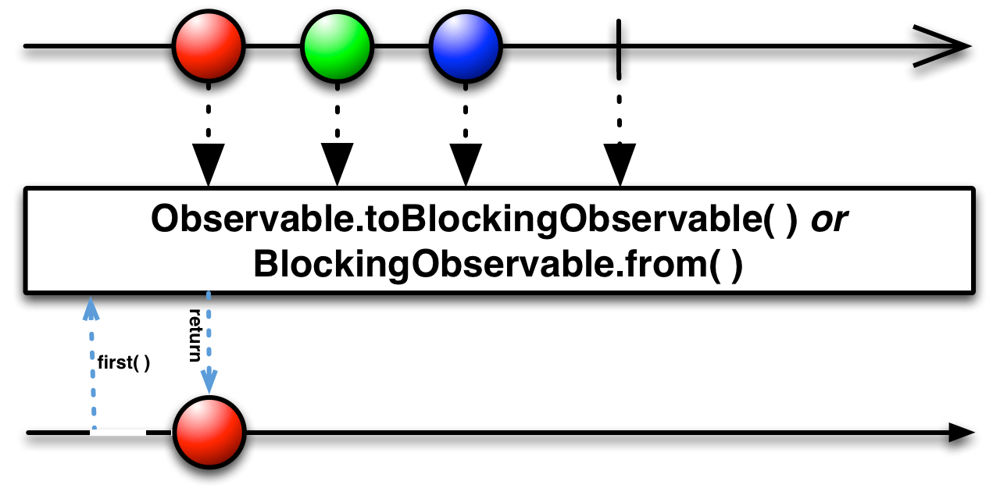
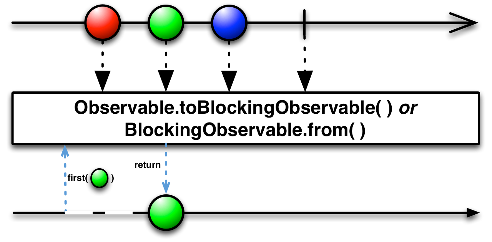
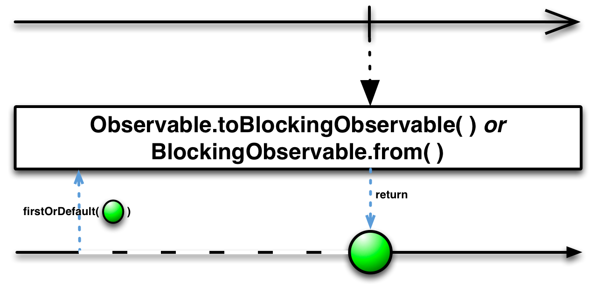
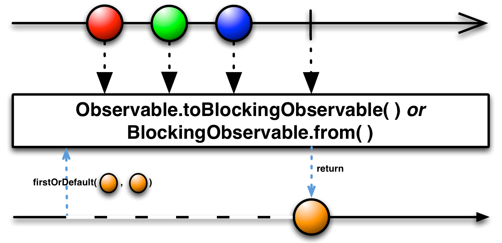
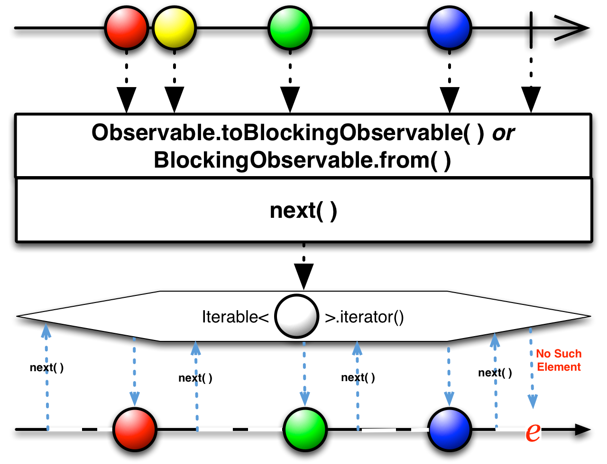
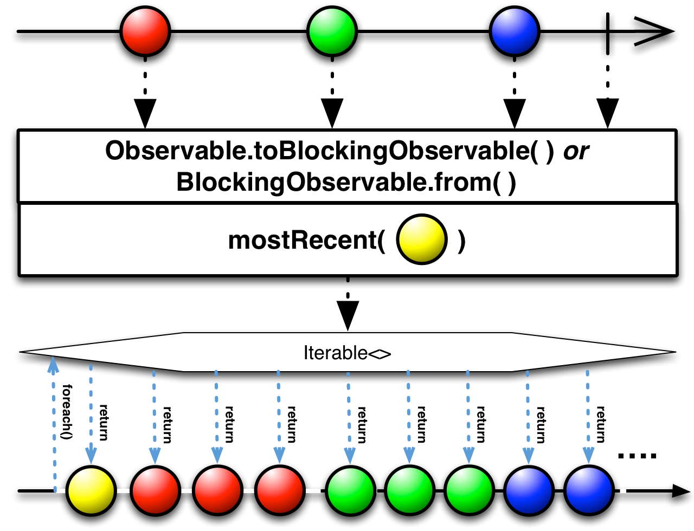

## BlockingObservable的方法

`BlockingObservable`的方法不是将一个Observable变换为另一个，也不是过滤Observables，它们会打断Observable的调用链，会阻塞等待直到Observable发送了它们想要的数据，然后返回这个数据（而不是一个Observable）。

要将一个Observable转换为一个`BlockingObservable`，你可以使用这些方法，使用`Observable.toBlocking`或`BlockingObservable.from`方法。

* Javadoc: [Observable.toBlocking()](http://reactivex.io/RxJava/javadoc/rx/Observable.html#toBlocking())
* Javadoc: [BlockingObservable.from(Observable)](http://reactivex.io/RxJava/javadoc/rx/observables/BlockingObservable.html#from(rx.Observable))

### first

要获取`BlockingObservable`的发射物，使用无参数的`first`方法。

* Javadoc: [BlockingObservable.first()](http://reactivex.io/RxJava/javadoc/rx/observables/BlockingObservable.html#first())

### first.p

你也可以给`first`方法传递一个谓词函数用于获取满足条件的`BlockingObservable`。

* Javadoc: [BlockingObservable.first(Func1)](http://reactivex.io/RxJava/javadoc/rx/observables/BlockingObservable.html#first(rx.functions.Func1))

### firstOrDefault

和过滤操作符一样，如果原始Observable没有数据，`first`会抛出异常`NoSuchElementException`，`firstOrDefault`会返回一个默认值。

* Javadoc: [BlockingObservable.firstOrDefault()](http://reactivex.io/RxJava/javadoc/rx/observables/BlockingObservable.html#firstOrDefault(T))

### firstOrDefault.p

`firstOrDefault`同样也接受一个谓词函数作为参数，用于获取满足条件的第一项，如果没有满足条件的就返回默认值。

* Javadoc: [BlockingObservable.firstOrDefault(T, Func1)](http://reactivex.io/RxJava/javadoc/rx/observables/BlockingObservable.html#firstOrDefault(T,%20rx.functions.Func1))

### single

`single`和`first`类似，但是如果不是正好发送一个数据，会抛出异常`NoSuchElementException`。其它几个变体的功能也是类似的。

* Javadoc: [single()](http://reactivex.io/RxJava/javadoc/rx/observables/BlockingObservable.html#single())

### single.p

同上，接受一个谓词函数，如果满足条件的不是正好一个，会抛出异常。

* Javadoc: [single(Func1)](http://reactivex.io/RxJava/javadoc/rx/observables/BlockingObservable.html#single(rx.functions.Func1))

### singleOrDefault

类似`firstOrDefault`，在为空时返回默认值，超过一个就抛出异常。

* Javadoc: [singleOrDefault(T)](http://reactivex.io/RxJava/javadoc/rx/observables/BlockingObservable.html#singleOrDefault(T))

### singleOrDefault.p

类似`firstOrDefault`，接受一个谓词函数，如果没有复合条件的，返回默认值；如果有多个复合条件的，以错误通知结束。

* Javadoc: [singleOrDefault(Func1,T)](http://reactivex.io/RxJava/javadoc/rx/observables/BlockingObservable.html#singleOrDefault(rx.functions.Func1,%20T))

### next

`next`操作符会阻塞直到`BlockingObservable`返回另外一个值，然后它返回那个值。你可以重复调用这个方法从`BlockingObservable`获取后续的数据项。以阻塞的方式高效的迭代获取它的发送物。

`latest`操作符也是类似的，但是它不会阻塞等待下一个值，它立即返回最近发送的数据项，只在Observable还没有发送任何数据时会阻塞。

* Javadoc: [next()](http://reactivex.io/RxJava/javadoc/rx/observables/BlockingObservable.html#next())
* Javadoc: [latest()](http://reactivex.io/RxJava/javadoc/rx/observables/BlockingObservable.html#latest())

### mostRecent

`mostRecent`操作符让你可以用类似的方式迭代一个`BlockingObservable`，但是它总是立即返回一个值，或者是默认值（如果`BlockingObservable`还没有发送任何数据），或者是`BlockingObservable`最近发送的数据项。

* Javadoc: [mostRecent(T)](http://reactivex.io/RxJava/javadoc/rx/observables/BlockingObservable.html#mostRecent(T))

