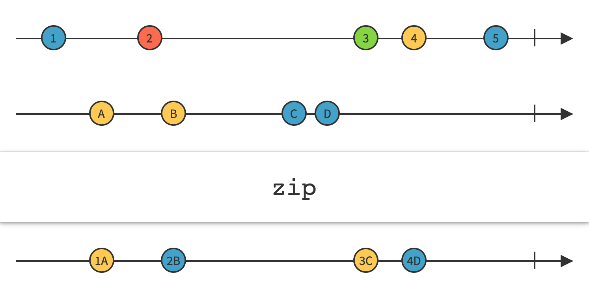
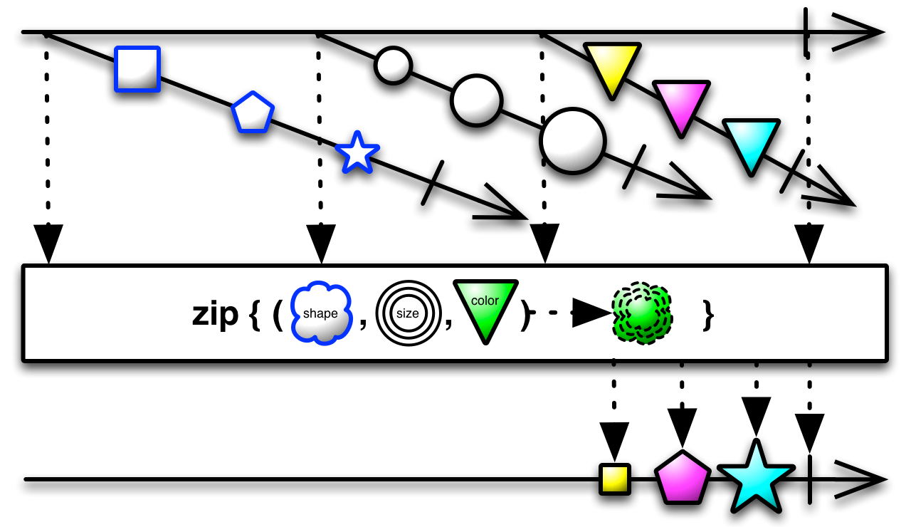
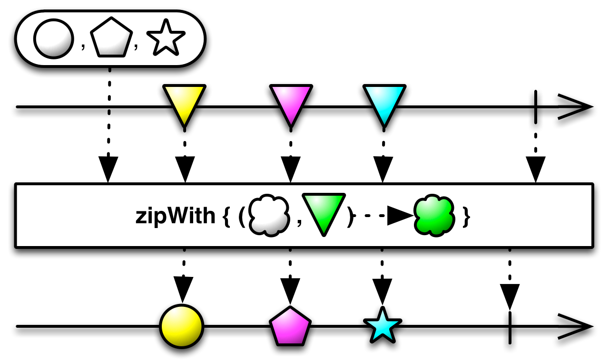
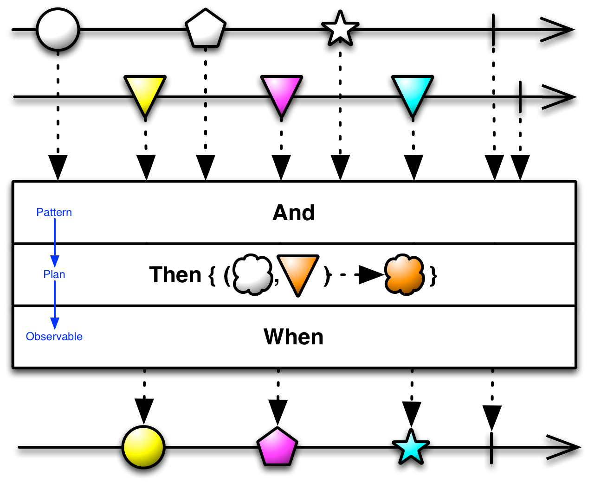
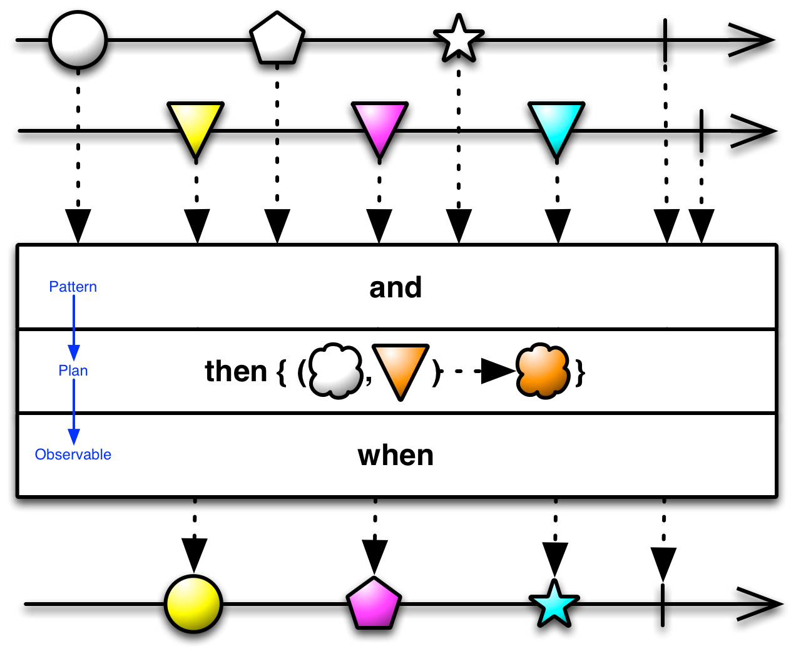
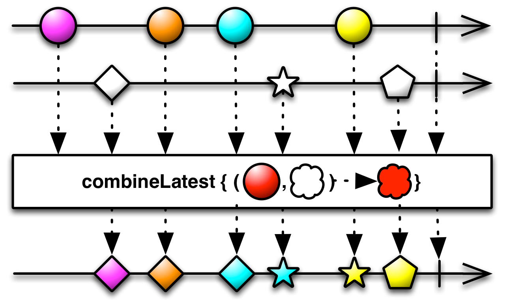
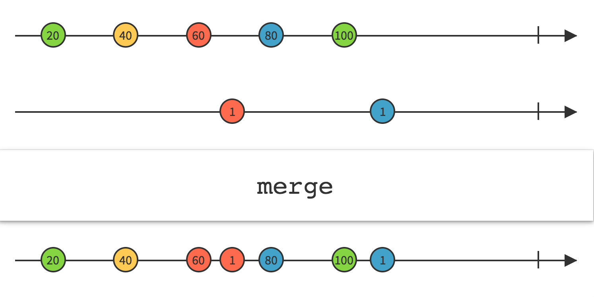
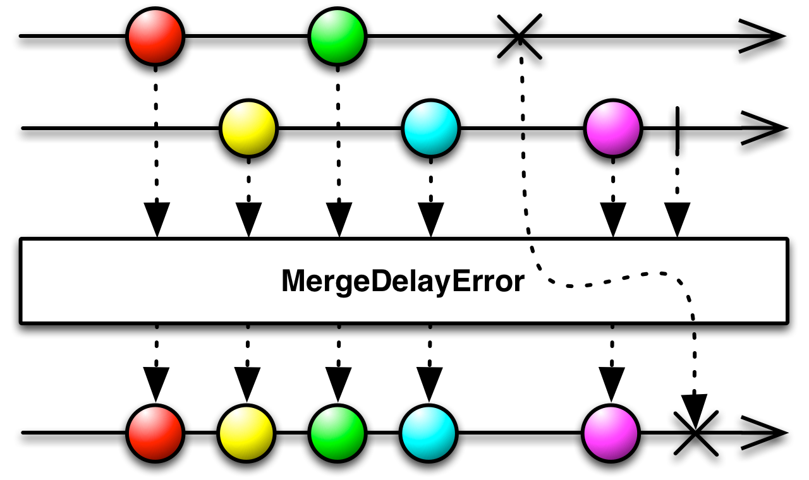
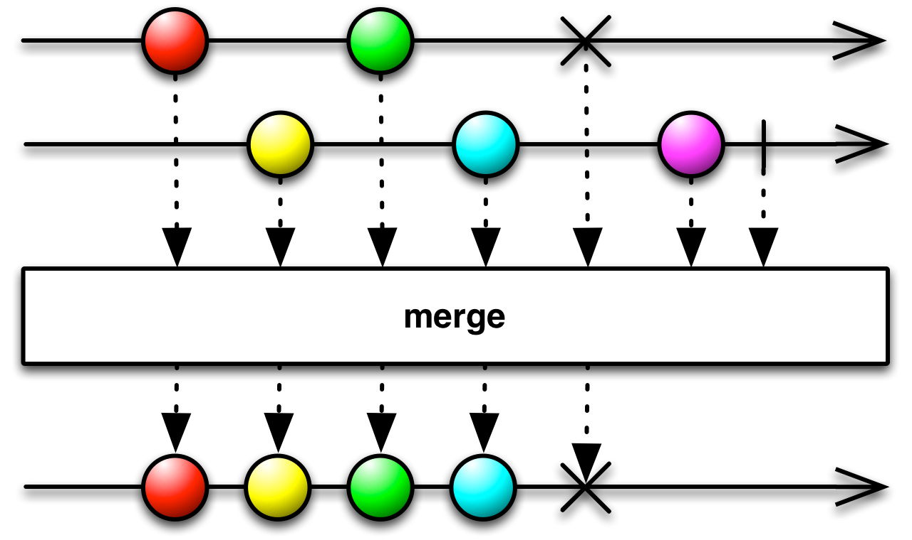
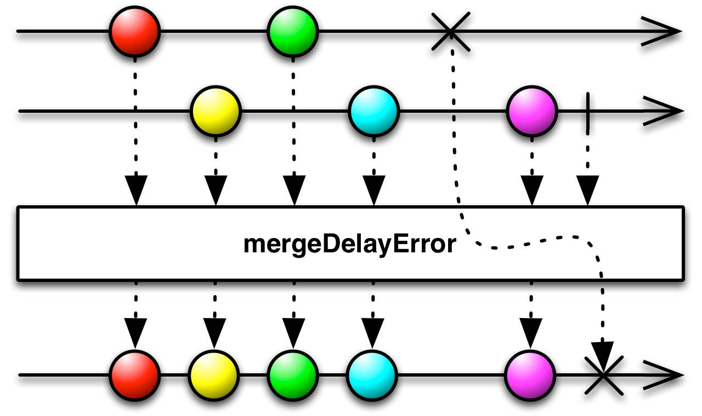

# 结合操作

## Zip

通过一个函数将多个Observables的发射物结合到一起，基于这个函数的结果为每个结合体发射单个数据项。



`Zip`操作符返回一个Obversable，它使用这个函数按顺序结合两个或多个Observables发送的数据项，然后它发射这个函数返回的结果。它按照严格的顺序应用这个函数。它只发送与发送数据项最少的那个Observable一样多的数据。

RxJava将这个操作符实现为`zip`和`zipWith`。



`zip`的最后一个参数接受每个Observable发送的一项数据，返回被压缩后的数据，它可以接受一到九个参数：一个Observable序列，或者一些发射Observable的Observables。

* Javadoc: [zip(Iterable<Observable>,FuncN)](http://reactivex.io/RxJava/javadoc/rx/Observable.html#zip(java.lang.Iterable,%20rx.functions.FuncN))
* Javadoc: [zip(Observable<Observable>,FuncN)](http://reactivex.io/RxJava/javadoc/rx/Observable.html#zip(rx.Observable,%20rx.functions.FuncN))
* Javadoc: [zip(Observable,Observable,Func2)](http://reactivex.io/RxJava/javadoc/rx/Observable.html#zip(rx.Observable,%20rx.Observable,%20rx.functions.Func2)) (最多可以有九个Observables参数)

### zipWith



`zipWith`操作符总是接受两个参数，第一个参数是一个Observable或者一个Iterable。

* Javadoc: [zipWith(Observable,Func2)](http://reactivex.io/RxJava/javadoc/rx/Observable.html#zipWith(rx.Observable,%20rx.functions.Func2))
* Javadoc: [zipWith(Iterable,Func2)](http://reactivex.io/RxJava/javadoc/rx/Observable.html#zipWith(java.lang.Iterable,%20rx.functions.Func2))

`zip`和`zipWith`默认不在任何特定的操作符上执行。

## And/Then/When

使用Pattern和Plan作为中介，将两个或多个Observables发送的数据集组合到一起



And/Then/When操作符组合的行为类似于`zip`，但是它们使用一个中间数据结构。接受两个或多个Observables，一次一个将它们的发射物结合到`Pattern`对象，然后操作那个`Pattern`对象，将它们变换为一个`Plan`。随后将这些`Plan`变换为Observable的发射物。



它们属于`rxjava-joins`模块，不是核心RxJava包的一部分。


## CombineLatest

当两个Observables中的任何一个发射了数据时，使用一个函数结合每个Observable发送的最近数据项，并且基于这个函数的结果发射数据。


`CombineLatest`操作符行为类似于`zip`，但是只有当原始的Observable中的每一个都发射了一条数据时`zip`才发射数据。`CombineLatest`则在原始的Observable中任意一个发射了数据时发射一条数据。当原始Observables的任何一个发射了一条数据时，`CombineLatest`使用一个函数结合它们最近发射的数据，然后发射这个函数的返回值。



RxJava将这个操作符实现为`combineLatest`，它接受二到九个Observable作为参数，或者单个Observables列表作为参数。它默认不在任何特定的调度器上执行。

* Javadoc: [combineLatest(List,FuncN)](http://reactivex.io/RxJava/javadoc/rx/Observable.html#combineLatest(java.util.List,%20rx.functions.FuncN))
* Javadoc: [combineLatest(Observable,Observable,Func2)](http://reactivex.io/RxJava/javadoc/rx/Observable.html#combineLatest(rx.Observable,%20rx.Observable,%20rx.functions.Func2))

### withLatestFrom


`withLatestFrom`操作符还在开发中，不是1.0版本的一部分。类似于`combineLatest `，但是只在单个原始Observable发射了一条数据时才发射数据。

## Join

任何时候，只要在另一个Observable发射的数据定义的时间窗口内，这个Observable发射了一条数据，就结合两个Observable发射的数据。


`Join`操作符结合两个Observable发射的数据，基于时间窗口（你定义的针对每条数据特定的原则）选择待集合的数据项。你将这些时间窗口实现为一些Observables，它们的生命周期从任何一条Observable发射的每一条数据开始。当这个定义时间窗口的Observable发射了一条数据或者完成时，与这条数据关联的窗口也会关闭。只要这条数据的窗口是打开的，它将继续结合其它Observable发射的任何数据项。你定义一个用于结合数据的函数。


很多ReactiveX实现还有一个类似的`GroupJoin`操作符。

Most ReactiveX implementations that have a Join operator also have a GroupJoin operator that is similar, except that the function you define to combine items emitted by the two Observables pairs individual items emitted by the source Observable not with an item from the second Observable, but with an Observable that emits items from the second Observable that fall in the same window.


The `join` operator takes four parameters:

1. the second Observable to combine with the source Observable
2. a function that accepts an item from the source Observable and returns an Observable whose lifespan governs the duration during which that item will combine with items from the second Observable
3. a function that accepts an item from the second Observable and returns an Observable whose lifespan governs the duration during which that item will combine with items from the first Observable
4. a function that accepts an item from the first Observable and an item from the second Observable and returns an item to be emitted by the Observable returned from join

`join`默认不在任何特定的调度器上执行。

* Javadoc: [Join(Observable,Func1,Func1,Func2)](http://reactivex.io/RxJava/javadoc/rx/Observable.html#join(rx.Observable,%20rx.functions.Func1,%20rx.functions.Func1,%20rx.functions.Func2))


The `groupJoin` operator takes four parameters:

1. the second Observable to combine with the source Observable
2. a function that accepts an item from the source Observable and returns an Observable whose lifespan governs the duration during which that item will combine with items from the second Observable
3. a function that accepts an item from the second Observable and returns an Observable whose lifespan governs the duration during which that item will combine with items from the first Observable
4. a function that accepts an item from the first Observable and an Observable that emits items from the second Observable and returns an item to be emitted by the Observable returned from groupJoin

`groupJoin `默认不在任何特定的调度器上执行。

* Javadoc: [groupJoin(Observable,Func1,Func1,Func2)](http://reactivex.io/RxJava/javadoc/rx/Observable.html#groupJoin(rx.Observable,%20rx.functions.Func1,%20rx.functions.Func1,%20rx.functions.Func2))


可选的`StringObservable`类中也有一个`join`操作符。它将一个发射字符串序列的Observable转换为一个发射单个字符串的Observable，`join`操作符使用指定的定界符将全部单独的字符串连接起来。


## Merge

合并多个Observables的发射物



使用`Merge`操作符你可以将多个Observables的输出合并，就好像它们是一个单个的Observable一样。

`Merge`可能会让合并的Observables发射的数据交错（有一个类似的操作符`Concat`不会让数据交错，它会按顺序一个接着一个发送多个Observables的发射物）。

正如图例上展示的，任何一个原始Observable的`onError`通知会被立即传递给观察者，而且会结束合并后的Observable。



在很多ReactiveX实现中还有一个叫`MergeDelayError`的操作符，它的行为有一点不同，它会保留`onError`通知直到合并后的Observable所有的数据发送完成，在那时它才会把`onError`传递给观察者。

RxJava将它实现为`merge`, `mergeWith`和`mergeDelayError`。



示例代码

```java

Observable<Integer> odds = Observable.just(1, 3, 5).subscribeOn(someScheduler);
Observable<Integer> evens = Observable.just(2, 4, 6);

Observable.merge(odds, evens)
          .subscribe(new Subscriber<Integer>() {
        @Override
        public void onNext(Integer item) {
            System.out.println("Next: " + item);
        }

        @Override
        public void onError(Throwable error) {
            System.err.println("Error: " + error.getMessage());
        }

        @Override
        public void onCompleted() {
            System.out.println("Sequence complete.");
        }
    });

```

输出

```
Next: 1
Next: 3
Next: 5
Next: 2
Next: 4
Next: 6
Sequence complete.
```

* Javadoc: [merge(Iterable)](http://reactivex.io/RxJava/javadoc/rx/Observable.html#merge(java.lang.Iterable))
* Javadoc: [merge(Iterable,int)](http://reactivex.io/RxJava/javadoc/rx/Observable.html#merge(java.lang.Iterable,%20int))
* Javadoc: [merge(Observable[])](http://reactivex.io/RxJava/javadoc/rx/Observable.html#merge(rx.Observable%5B%5D))
* Javadoc: [merge(Observable,Observable)](http://reactivex.io/RxJava/javadoc/rx/Observable.html#merge(rx.Observable,%20rx.Observable)) (接受二到九个Observable)

除了传递多个Observable给`merge`，你还可以传递一个Observable列表`List`，数组，甚至是一个发射Observable序列的Observable，`merge`将合并它们的输出作为单个Observable的输出：


如果你传递一个发射Observables序列的Observable，你可以指定`merge`应该同时订阅的Observable'的最大数量。一旦达到订阅数的限制，它将不再订阅原始Observable发射的任何其它Observable，直到某个已经订阅的Observable发射了`onCompleted`通知。

* Javadoc: [merge(Observable<Observable>)](http://reactivex.io/RxJava/javadoc/rx/Observable.html#merge(rx.Observable))
* Javadoc: [merge(Observable<Observable>,int)](http://reactivex.io/RxJava/javadoc/rx/Observable.html#merge(rx.Observable,%20int))

`merge`是静态方法，`mergeWith`是对象方法，举个例子，`Observable.merge(odds,evens)`等价于`odds.mergeWith(evens)`。

如果传递给`merge`的任何一个的Observable发射了`onError`通知终止了，`merge`操作符生成的Observable也会立即以`onError`通知终止。如果你想让它继续发射数据，在最后才报告错误，可以使用`mergeDelayError`。



`mergeDelayError` behaves much like `merge`. The exception is when one of the Observables being merged terminates with an onError notification. If this happens with merge, the merged Observable will immediately issue an `onError` notification and terminate. `mergeDelayError`, on the other hand, will hold off on reporting the error until it has given any other non-error-producing Observables that it is merging a chance to finish emitting their items, and it will emit those itself, and will only terminate with an `onError` notification when all of the other merged Observables have finished.

Because it is possible that more than one of the merged Observables encountered an error, `mergeDelayError` may pass information about multiple errors in the onError notification (it will never invoke the observer’s `onError` method more than once). For this reason, if you want to know the nature of these errors, you should write your observers’ onError methods so that they accept a parameter of the class `CompositeException`.

`mergeDelayError` has fewer variants. You cannot pass it an Iterable or Array of Observables, but you can pass it an Observable that emits Observables or between one and nine individual Observables as parameters. There is not an instance method version of `mergeDelayError` as there is for `merge`.

* Javadoc: [mergeDelayError(Observable<Observable>)](http://reactivex.io/RxJava/javadoc/rx/Observable.html#mergeDelayError(rx.Observable))
* Javadoc: [mergeDelayError(Observable,Observable)](http://reactivex.io/RxJava/javadoc/rx/Observable.html#mergeDelayError(rx.Observable,%20rx.Observable))


## StartWith

在数据序列的开头插入一条指定的项


如果你想要一个Observable在发射数据之前先发射一个指定的数据序列，可以使用`StartWith`操作符。（如果你想一个Observable发射的数据末尾追加一个数据序列可以使用`Concat`操作符。）


可接受一个Iterable或者多个Observable作为函数的参数。

* Javadoc: [startWith(Iterable)](http://reactivex.io/RxJava/javadoc/rx/Observable.html#startWith(java.lang.Iterable))
* Javadoc: [startWith(T)](http://reactivex.io/RxJava/javadoc/rx/Observable.html#startWith(T)) (最多接受九个参数)


你也可以传递一个Observable给`startWith`，它会将那个Observable的发射物插在原始Observable发射的数据序列之前，然后把这个当做自己的发射物集合。这可以看作是`Concat`的反转。

* Javadoc: [startWith(Observable)](http://reactivex.io/RxJava/javadoc/rx/Observable.html#startWith(rx.Observable))


## Switch

将一个发射多个Observables的Observable转换成另一个单独的Observable，后者发射那些Observables最近发射的数据项


`Switch`订阅一个发射多个Observables的Observable。它每次观察那些Observables中的一个，`Switch`返回的这个Observable取消订阅前一个发射数据的Observable，开始发送最近的Observable发射的数据。注意：当原始Observable发射了一个新的Observable时（不是这个新的Observable发射了一条数据时），它将取消订阅之前的那个Observable。这意味着，在后来那个Observable产生之后到它开始发射数据之前的这段时间里，前一个Observable发射的数据将被丢弃（就像图例上的那个黄色圆圈一样）。

Java将这个操作符实现为`switchOnNext`。它默认不在任何特定的调度器上执行。

* Javadoc: [switchOnNext(Observable)](http://reactivex.io/RxJava/javadoc/rx/Observable.html#switchOnNext(rx.Observable))


