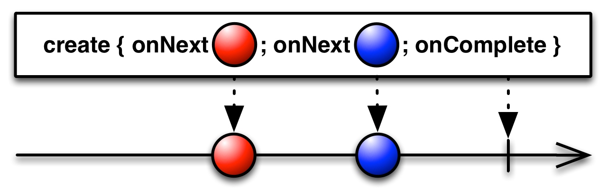
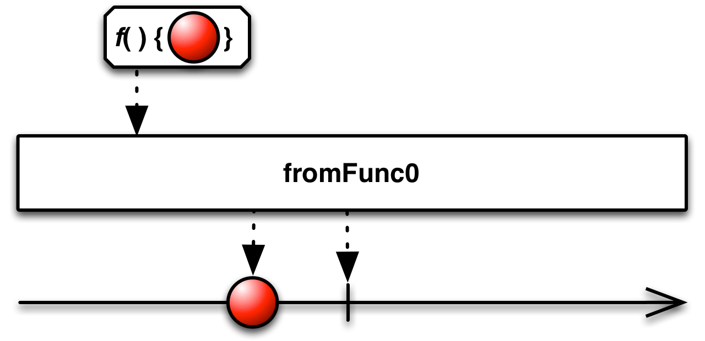
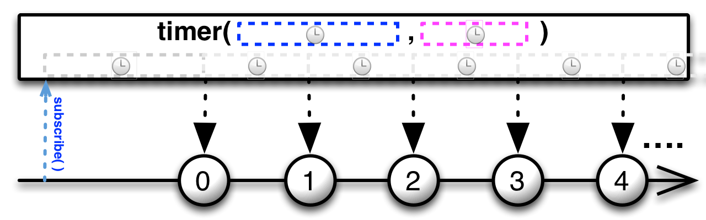
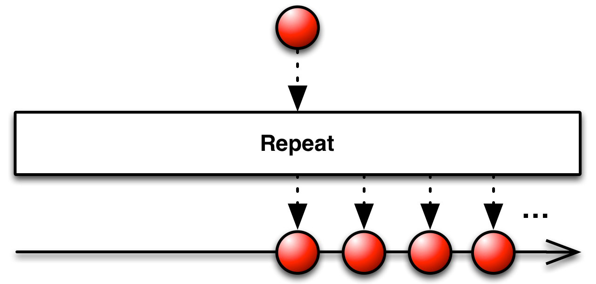
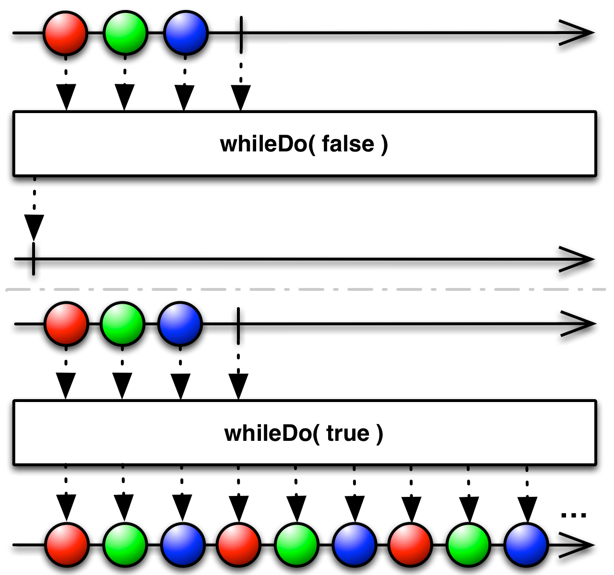
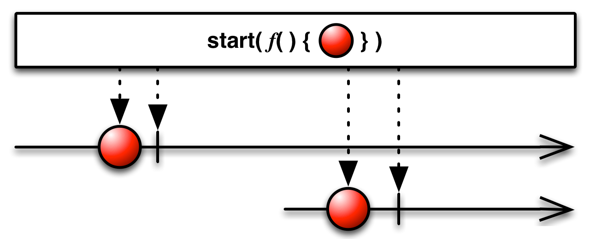
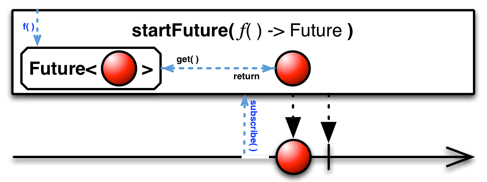
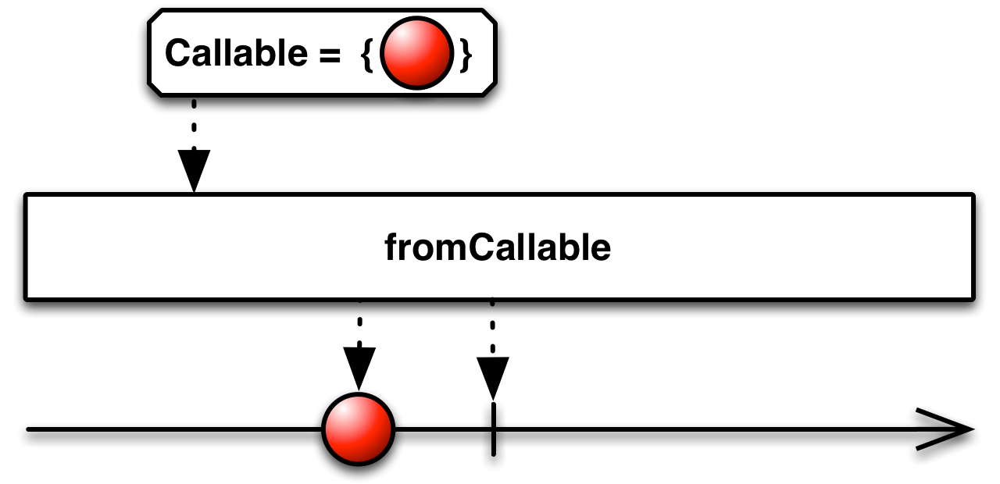

# 创建操作

## Create

使用一个函数从头开始创建一个Observable


你可以使用`Create `操作符从头开始创建一个Observable，给这个操作符传递一个接受观察者作为参数的函数，编写这个函数让它的行为表现为一个Observable--恰当的调用观察者的onNext，onError和onCompleted方法。

一个形式正确的有限Observable必须尝试调用观察者的onCompleted正好一次或者它的onError正好一次，而且此后不能再调用观察者的任何其它方法。



RxJava将这个操作符实现为 `create` 方法。

建议你在传递给`create`方法的函数中检查观察者的`isUnsubscribed`状态，以便在没有观察者的时候，让你的Observable停止发送数据或者做昂贵的运算。

示例代码：

```java

Observable.create(new Observable.OnSubscribe<Integer>() {
    @Override
    public void call(Subscriber<? super Integer> observer) {
        try {
            if (!observer.isUnsubscribed()) {
                for (int i = 1; i < 5; i++) {
                    observer.onNext(i);
                }
                observer.onCompleted();
            }
        } catch (Exception e) {
            observer.onError(e);
        }
    }
 } ).subscribe(new Subscriber<Integer>() {
        @Override
        public void onNext(Integer item) {
            System.out.println("Next: " + item);
        }

        @Override
        public void onError(Throwable error) {
            System.err.println("Error: " + error.getMessage());
        }

        @Override
        public void onCompleted() {
            System.out.println("Sequence complete.");
        }
    });

```

输出：

```
Next: 1
Next: 2
Next: 3
Next: 4
Sequence complete.
```	

`create`方法默认不在任何特定的调度器上执行。

* Javadoc: [`create(OnSubscribe)`](http://reactivex.io/RxJava/javadoc/rx/Observable.html#create(rx.Observable.OnSubscribe))


## Defer

直到有观察者订阅时才创建Observable，并且为每个观察者创建一个新的Observable


`Defer`操作符会一直等待直到有观察者订阅它，然后它使用Observable工厂方法生成一个Observable。它对每个观察者都这样做，因此尽管每个订阅者都以为自己订阅的是同一个Observable，事实上每个订阅者获取的是它们自己的单独的数据序列。

在某些情况下，等待直到最后一分钟（就是知道订阅发生时）才生成Observable可以确保Observable包含最新的数据。


RxJava将这个操作符实现为 `defer` 方法。这个操作符接受一个你选择的Observable工厂函数作为单个参数。这个函数没有参数，返回一个Observable。

`defer`方法默认不在任何特定的调度器上执行。

* Javadoc: [`defer(Func0)`](http://reactivex.io/RxJava/javadoc/rx/Observable.html#defer(rx.functions.Func0))

### switchCase


可选包 `rxjava-computation-expressions` 中有一个类似的操作符。`switchCase`操作符有条件的创建并返回一个可能的Observables集合中的一个。


可选包 `rxjava-computation-expressions` 中还有一个更简单的操作符叫`ifThen`。这个操作符检查某个条件，然后根据结果，返回原始Observable的镜像，或者返回一个空Observable。


## Empty/Never/Throw

### Empty
创建一个不发送任何数据但是正常结束的Observable

### Never
创建一个不发送数据也不结束的Observable

### Throw
创建一个不发送数据以一个错误结束的Observable

这三个操作符生成的Observable行为非常特殊和受限。测试的时候很有用，有时候也用于结合其它的Observables，或者作为其它需要Observable的操作符的参数。

RxJava将这些操作符实现为 `empty`，`never`和`error`。`error`操作符需要一个`Throwable`参数，你的Observable会以此结束。这些操作符默认不在任何特定的调度器上执行，但是`empty`和`error`有一个可选参数是Scheduler，如果你传递了Scheduler参数，它们会在这个调度器上发送通知。

* Javadoc: [empty()](http://reactivex.io/RxJava/javadoc/rx/Observable.html#empty())
* Javadoc: [never()](http://reactivex.io/RxJava/javadoc/rx/Observable.html#never())
* Javadoc: [error(java.lang.Throwable)](http://reactivex.io/RxJava/javadoc/rx/Observable.html#error(java.lang.Throwable))


## From

将其它种类的对象和数据类型转换为Observable


当你使用Observable时，如果你要处理的数据都可以转换成展现为Observables，而不是需要混合使用Observables和其它类型的数据，会非常方便。这让你在数据流的整个生命周期中，可以使用一组统一的操作符来管理它们。

例如，Iterable可以看成是同步的Observable；Future，可以看成是总是只发送单个数据的Observable。通过显式地将那些数据转换为Observables，你可以像使用Observable一样与它们交互。

因此，大部分ReactiveX实现都提供了将语言特定的对象和数据结构转换为Observables的方法。


在RxJava中，`from`操作符可以转换Future、Iterable和数组。对于Iterable和数组，产生的Observable会发送Iterable或数组的每一项数据。

示例代码

```java

Integer[] items = { 0, 1, 2, 3, 4, 5 };
Observable myObservable = Observable.from(items);

myObservable.subscribe(
    new Action1<Integer>() {
        @Override
        public void call(Integer item) {
            System.out.println(item);
        }
    },
    new Action1<Throwable>() {
        @Override
        public void call(Throwable error) {
            System.out.println("Error encountered: " + error.getMessage());
        }
    },
    new Action0() {
        @Override
        public void call() {
            System.out.println("Sequence complete");
        }
    }
);

```

输出

```
0
1
2
3
4
5
Sequence complete
```

对于Future，它会发送Future.get()方法返回的单个数据。`from`方法有一个可接受两个可选参数的版本，分别指定超时时长和时间单位。如果过了指定的时长Future还没有返回一个值，这个Observable会发送错误通知并结束。

`from`默认不在任何特定的调度器上执行。然而你可以将Scheduler作为可选的第二个参数传递给Observable，它会在那个调度器上管理这个Future。

* Javadoc: [from(array)](http://reactivex.io/RxJava/javadoc/rx/Observable.html#from(T%5B%5D))
* Javadoc: [from(Iterable)](http://reactivex.io/RxJava/javadoc/rx/Observable.html#from(java.lang.Iterable))
* Javadoc: [from(Future)](http://reactivex.io/RxJava/javadoc/rx/Observable.html#from(java.util.concurrent.Future))
* Javadoc: [from(Future,Scheduler)](http://reactivex.io/RxJava/javadoc/rx/Observable.html#from(java.util.concurrent.Future,%20rx.Scheduler))
* Javadoc: [from(Future,timeout, timeUnit)](http://reactivex.io/RxJava/javadoc/rx/Observable.html#from(java.util.concurrent.Future,%20long,%20java.util.concurrent.TimeUnit))

### RxJavaAsyncUtil



此外，在可选包 `RxJavaAsyncUtil` 中，你还可以用下面这些操作符将actions，callables，functions和runnables转换为发送这些动作的执行结果的Observable：

* fromAction
* fromCallable
* fromFunc0
* fromRunnable

在这个页面 [Start](http://reactivex.io/documentation/operators/start.html) 查看关于这些操作符的更多信息。


注意：还有一个可选的`StringObservable`类中也有一个`from`方法，它将一个字符流或者一个REader转换为一个发送字节数组或字符串的Observable。

### runAsync2

注意：这里与后面`start`操作符里的`runAsync`说明重复了

在单独的`RxJavaAsyncUtil`包中（默认不包含在RxJava中）,还有一个`runAsync`函数。传递一个`Action`和一个`Scheduler`给`runAsync`，它会返回一个`StoppableObservable`，这个Observable使用`Action`产生发送的数据项。

传递一个`Action`和一个`Scheduler`给`runAsync`，它返回一个使用这个`Action`产生数据的`StoppableObservable`。这个`Action`接受一个`Observable`和一个`Subscription`作为参数，它使用`Subscription`检查`unsubscribed`条件，一旦发现条件为真就立即停止发送数据。在任何时候你都可以使用`unsubscribe`方法手动停止一个`StoppableObservable`（这会同时取消订阅与这个`StoppableObservable`关联的`Subscription`）。

由于`runAsync`会立即调用`Action`并开始发送数据，在你创建StoppableObservable之后到你的观察者准备好接受数据之前这段时间里，可能会有一部分数据会丢失。如果这不符合你的要求，可以使用`runAsync`的一个变体，它也接受一个`Subject`参数，传递一个`ReplaySubject`给它，你可以获取其它丢失的数据了。

### decode


`StringObservable`类不是默认RxJava的一部分，包含一个`decode`操作符，这个操作符将一个多字节字符流转换为一个发送字节数组的Observable，这些字节数组按照字符的边界划分。


## Interval

创建一个按固定时间间隔发送整数序列的Observable


`Interval`操作符返回一个Observable，它按固定的时间间隔发送一个无限递增的整数序列。


RxJava将这个操作符实现为`interval`方法。它接受一个表示时间间隔的参数和一个表示时间单位的参数。

* Javadoc: [interval(long,TimeUnit)](http://reactivex.io/RxJava/javadoc/rx/Observable.html#interval(long,%20java.util.concurrent.TimeUnit))
* Javadoc: [interval(long,TimeUnit,Scheduler)](http://reactivex.io/RxJava/javadoc/rx/Observable.html#interval(long,%20java.util.concurrent.TimeUnit%20rx.Scheduler))



还有一个版本的`interval`返回一个Observable，它在指定延迟之后先发送一个零值，然后再按照指定的时间间隔发送递增的数字。这个版本的`interval`在RxJava 1.0.0中叫做`timer`，但是那个方法已经不建议使用了，因为一个名叫`interval`的操作符有同样的功能。

Javadoc: [interval(long,long,TimeUnit)](http://reactivex.io/RxJava/javadoc/rx/Observable.html#interval(long,%20long,%20java.util.concurrent.TimeUnit))
Javadoc: [interval(long,long,TimeUnit,Scheduler)](http://reactivex.io/RxJava/javadoc/rx/Observable.html#interval(long,%20long,%20java.util.concurrent.TimeUnit,%20rx.Scheduler))

`interval`默认在`computation`调度器上执行。你也可以传递一个可选的Scheduler参数来指定调度器。


## Just

创建一个发送指定值的Observable


Just将单个数据转换为发送那个数据的Observable。

Just类似于From，但是From会将数组或Iterable的素具取出然后逐个发送，而Just只是简单的原样发送，将数组或Iterable当做单个数据。

注意：如果你传递`null`给Just，它会返回一个发送`null`值的Observable。不要误认为它会返回一个空Observable（完全不发送任何数据的Observable），如果需要空Observable你应该使用[Empty](#Empty)操作符。

RxJava将这个操作符实现为`just`函数，它接受一至九个参数，返回一个按参数列表顺序发送这些数据的Observable。

示例代码：

```java

Observable.just(1, 2, 3)
          .subscribe(new Subscriber<Integer>() {
        @Override
        public void onNext(Integer item) {
            System.out.println("Next: " + item);
        }

        @Override
        public void onError(Throwable error) {
            System.err.println("Error: " + error.getMessage());
        }

        @Override
        public void onCompleted() {
            System.out.println("Sequence complete.");
        }
    });

```

输出

```
Next: 1
Next: 2
Next: 3
Sequence complete.
```

* Javadoc: [just(item)](http://reactivex.io/RxJava/javadoc/rx/Observable.html#just(T)) (还有其它接受二到九个参数的版本)


## Range

创建一个发送特定整数序列的Observable


Range操作符发送一个范围内的有序整数序列，你可以指定范围的起始和长度。

RxJava将这个操作符实现为`range`函数，它接受两个参数，一个是范围的起始值，一个是范围的数据的数目。如果你将第二个参数设为0，将导致Observable不发送任何数据（如果设置为负数，会抛异常）。

`range`默认不在任何特定的调度器上执行。有一个变体可以通过可选参数指定Scheduler。

* Javadoc: [range(int,int)](http://reactivex.io/RxJava/javadoc/rx/Observable.html#range(int,%20int))
* Javadoc: [range(int,int,Scheduler)](http://reactivex.io/RxJava/javadoc/rx/Observable.html#range(int,%20int%20rx.Scheduler))


## Repeat

创建一个发送特定数据重复多次的Observable



Repeat重复地发送数据。某些实现允许你重复的发送某个数据序列，还有一些允许你限制重复的次数。


RxJava将这个操作符实现为`repeat`方法。它不是创建一个Observable，而是重复发送原始Observable的数据序列，这个序列或者是无限的，或者通过`repeat(n)`指定重复次数。

`repeat`操作符默认在`trampoline`调度器上执行。有一个变体可以通过可选参数指定Scheduler。

Javadoc: [repeat()](http://reactivex.io/RxJava/javadoc/rx/Observable.html#repeat())
Javadoc: [repeat(long)](http://reactivex.io/RxJava/javadoc/rx/Observable.html#repeat(long))
Javadoc: [repeat(Scheduler)](http://reactivex.io/RxJava/javadoc/rx/Observable.html#repeat(rx.Scheduler))
Javadoc: [repeat(long,Scheduler)](http://reactivex.io/RxJava/javadoc/rx/Observable.html#repeat(long,%20rx.Scheduler))

### repeatWhen


还有一个叫做`repeatWhen`的操作符，它不是缓存和重放原Observable的数据序列，而是有条件的重新订阅和反射原来的Observable。

将原Observable的结束通知（完成或错误）当做一个`void`数据传递给一个通知处理器，它以此来决定是否要重新订阅和反射原来的Observable。这个通知处理器就像一个Observable操作符，接受一个发送`void`通知的Observable为输入，返回一个发送`void`数据（意思是，重新订阅和反射原Observable）或者直接结束（意思是，使用`repeatWhen`结束发送数据）的Observable。

`repeatWhen`操作符默认在`trampoline`调度器上执行。有一个变体可以通过可选参数指定Scheduler。

* Javadoc: [repeatWhen(Func1)](http://reactivex.io/RxJava/javadoc/rx/Observable.html#repeatWhen(rx.functions.Func1))
* Javadoc: [repeatWhen(Func1,Scheduler)](http://reactivex.io/RxJava/javadoc/rx/Observable.html#repeatWhen(rx.functions.Func1,%20rx.Scheduler))


### doWhile


`doWhile` 属于可选包`rxjava-computation-expressions`，不是RxJava标准操作符的一部分。`doWhile`在原始序列的每次重复后检查某个条件，如果满足条件才重复发送。

### whileDo



`whileDo` 属于可选包`rxjava-computation-expressions`，不是RxJava标准操作符的一部分。`whileDo`在原始序列的每次重复前检查某个条件，如果满足条件才重复发送。


## Start

返回一个Observable，它发送一个类似于函数声明的值



编程语言有很多种方法可以从运算结果中获取值，它们的名字一般叫`functions, futures, actions, callables, runnables`等等。在`Start`目录下的这组操作符可以让它们表现得像Observable，因此它们可以在Observables调用链中与其它Observable搭配使用。

`Start`操作符的多种RxJava实现都属于可选的`rxjava-async`模块。

`rxjava-async`模块包含`start`操作符，它接受一个函数作为参数，调用这个函数获取一个值，然后返回一个会发送这个值给后续观察者的Observable。

注意：这个函数只会被执行一次，即使多个观察者订阅这个返回的Observable。

### toAsync


`rxjava-async`模块还包含这几个操作符：`toAsync`, `asyncAction`, 和`asyncFunc`。它们接受一个函数或一个Action作为参数。

对于函数(functions)，这个操作符调用这个函数获取一个值，然后返回一个会发送这个值给后续观察者的Observable（和`start`一样）。对于动作(Action)，过程类似，但是没有返回值，在这种情况下，这个操作符在结束前会发送一个`null`值。

注意：这个函数或动作只会被执行一次，即使多个观察者订阅这个返回的Observable。

### startFuture



`rxjava-async`模块还包含一个`startFuture`操作符，传递给它一个返回`Future`的函数，`startFuture`会立即调用这个函数获取`Future`对象，然后调用`Future`的`get()`方法尝试获取它的值。它返回一个发送这个值给后续观察者的Observable。

### deferFuture


`rxjava-async`模块还包含一个`deferFuture`操作符，传递给它一个返回`Future`的函数（这个`Future`返回一个`Observable`），`deferFuture`返回一个Observable，但是不会调用你提供的函数，知道有观察者订阅它返回的Observable。这时，它立即调用`Future`的`get()`方法，然后镜像发送`get()`方法返回的Observable发送的数据。

用这种方法，你可以在Observables调用链中包含一个返回Observable的`Future`对象。

### fromAction



`rxjava-async`模块还包含一个`fromAction`操作符，它接受一个`Action`作为参数，返回一个Observable，一旦Action结束，它发送这个你传递给`fromAction`的数据。

### fromCallable


`rxjava-async`模块还包含一个`fromCallable`操作符，它接受一个`Callable`作为参数，返回一个发送这个`Callable`的结果的Observable。

### fromRunnable


`rxjava-async`模块还包含一个`fromRunnable`操作符，它接受一个`Runnable `作为参数，返回一个Observable，一旦Runnable结束，它发送这个你传递给`fromRunnable`的数据。

### forEachFuture


`rxjava-async`模块还包含一个`forEachFuture`操作符。它其实不算`Start`操作符的一个变体，而是有一些自己的特点。你传递一些典型的观察者方法（如onNext, onError和onCompleted）给它，Observable会以通常的方式调用它。但是`forEachFuture`自己返回一个`Future`并且在`get()`方法处阻塞，直到原Observable执行完成，然后它返回，完成还是错误依赖于原Observable是完成还是错误。

如果你想要一个函数阻塞直到Observable执行完成，可以使用这个操作符。

### runAsync

`rxjava-async`模块还包含一个`runAsync`操作符。它很特殊，返回一个叫做`StoppableObservable `的特殊Observable。

传递一个`Action`和一个`Scheduler`给`runAsync`，它返回一个使用这个`Action`产生数据的`StoppableObservable`。这个`Action`接受一个`Observable`和一个`Subscription`作为参数，它使用`Subscription`检查`unsubscribed`条件，一旦发现条件为真就立即停止发送数据。在任何时候你都可以使用`unsubscribe`方法手动停止一个`StoppableObservable`（这会同时取消订阅与这个`StoppableObservable`关联的`Subscription`）。

由于`runAsync`会立即调用`Action`并开始发送数据，在你创建StoppableObservable之后到你的观察者准备好接受数据之前这段时间里，可能会有一部分数据会丢失。如果这不符合你的要求，可以使用`runAsync`的一个变体，它也接受一个`Subject`参数，传递一个`ReplaySubject`给它，你可以获取其它丢失的数据了。

在RxJava中还有一个版本的`From`操作符可以将Future转换为Observable，与`start`相似。


## Timer

创建一个Observable，它在一个给定的延迟后发送一个特殊的值。


`Timer`操作符创建一个在给定的时间段之后返回一个特殊值的Observable。

RxJava将这个操作符实现为`timer`函数。

`timer`返回一个Observable，它在延迟一段给定的时间后发送一个简单的数字0。

`timer `操作符默认在`computation `调度器上执行。有一个变体可以通过可选参数指定Scheduler。

* Javadoc: [timer(long,TimeUnit)](http://reactivex.io/RxJava/javadoc/rx/Observable.html#timer(long,%20java.util.concurrent.TimeUnit))
* Javadoc: [timer(long,TimeUnit,Scheduler)](http://reactivex.io/RxJava/javadoc/rx/Observable.html#timer(long,%20java.util.concurrent.TimeUnit,%20rx.Scheduler))


