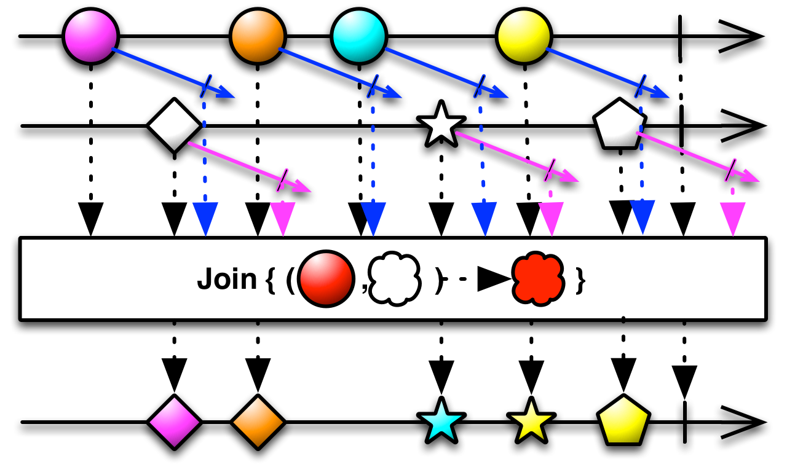
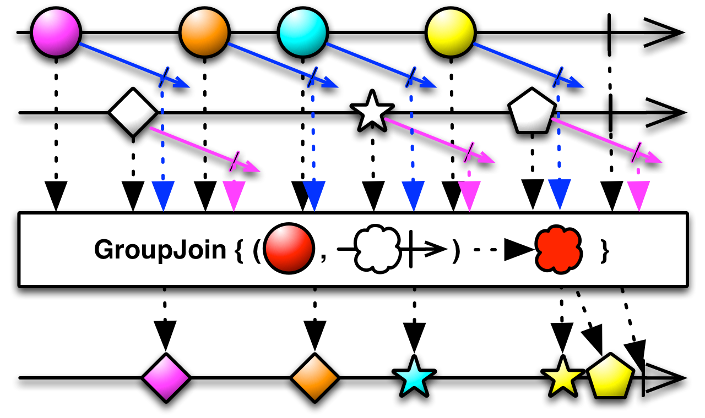
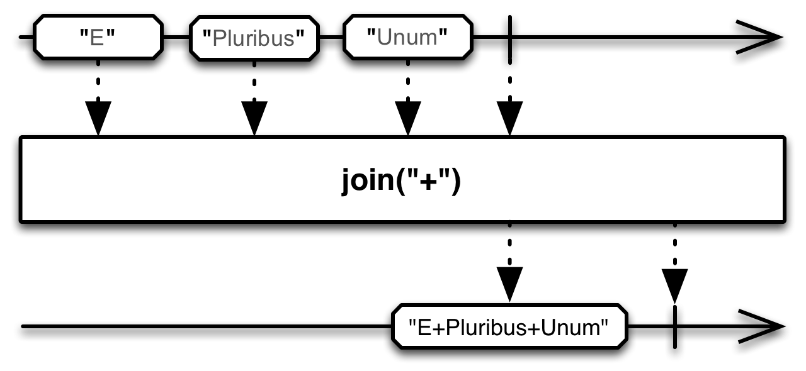

## Join

任何时候，只要在另一个Observable发射的数据定义的时间窗口内，这个Observable发射了一条数据，就结合两个Observable发射的数据。

`Join`操作符结合两个Observable发射的数据，基于时间窗口（你定义的针对每条数据特定的原则）选择待集合的数据项。你将这些时间窗口实现为一些Observables，它们的生命周期从任何一条Observable发射的每一条数据开始。当这个定义时间窗口的Observable发射了一条数据或者完成时，与这条数据关联的窗口也会关闭。只要这条数据的窗口是打开的，它将继续结合其它Observable发射的任何数据项。你定义一个用于结合数据的函数。

很多ReactiveX实现还有一个类似的`GroupJoin`操作符。

Most ReactiveX implementations that have a Join operator also have a GroupJoin operator that is similar, except that the function you define to combine items emitted by the two Observables pairs individual items emitted by the source Observable not with an item from the second Observable, but with an Observable that emits items from the second Observable that fall in the same window.

The `join` operator takes four parameters:

1. the second Observable to combine with the source Observable
2. a function that accepts an item from the source Observable and returns an Observable whose lifespan governs the duration during which that item will combine with items from the second Observable
3. a function that accepts an item from the second Observable and returns an Observable whose lifespan governs the duration during which that item will combine with items from the first Observable
4. a function that accepts an item from the first Observable and an item from the second Observable and returns an item to be emitted by the Observable returned from join

`join`默认不在任何特定的调度器上执行。

* Javadoc: [Join(Observable,Func1,Func1,Func2)](http://reactivex.io/RxJava/javadoc/rx/Observable.html#join(rx.Observable,%20rx.functions.Func1,%20rx.functions.Func1,%20rx.functions.Func2))

The `groupJoin` operator takes four parameters:

1. the second Observable to combine with the source Observable
2. a function that accepts an item from the source Observable and returns an Observable whose lifespan governs the duration during which that item will combine with items from the second Observable
3. a function that accepts an item from the second Observable and returns an Observable whose lifespan governs the duration during which that item will combine with items from the first Observable
4. a function that accepts an item from the first Observable and an Observable that emits items from the second Observable and returns an item to be emitted by the Observable returned from groupJoin

`groupJoin `默认不在任何特定的调度器上执行。

* Javadoc: [groupJoin(Observable,Func1,Func1,Func2)](http://reactivex.io/RxJava/javadoc/rx/Observable.html#groupJoin(rx.Observable,%20rx.functions.Func1,%20rx.functions.Func1,%20rx.functions.Func2))

可选的`StringObservable`类中也有一个`join`操作符。它将一个发射字符串序列的Observable转换为一个发射单个字符串的Observable，`join`操作符使用指定的定界符将全部单独的字符串连接起来。
