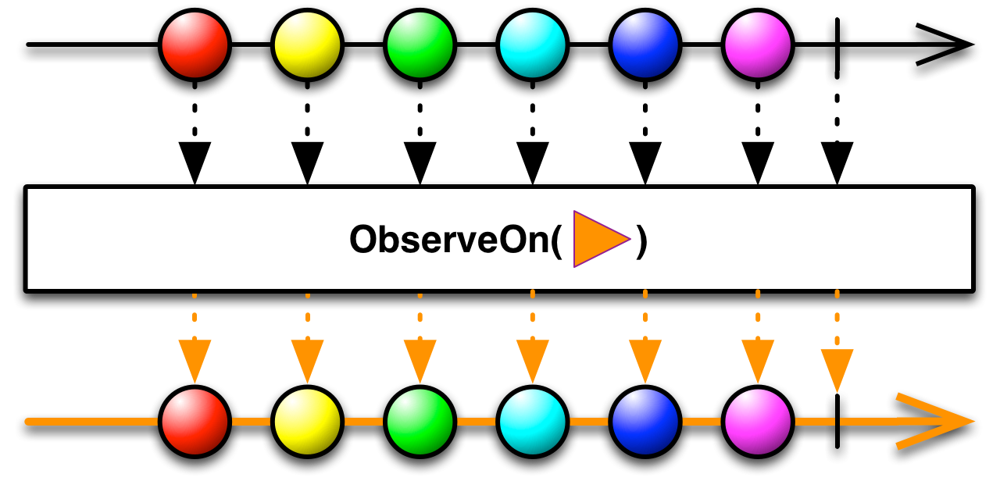
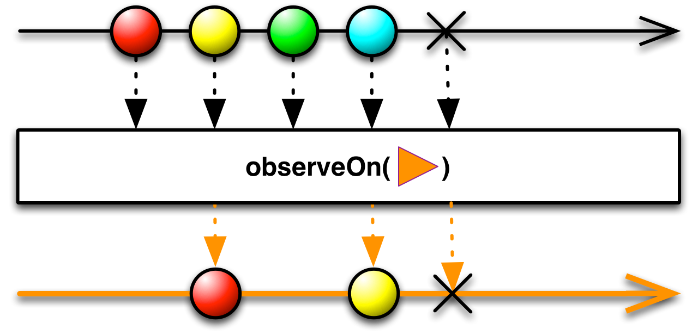

## ObserveOn

指定一个观察者在哪个调度器上观察这个Observable

很多ReactiveX实现都使用调度器 ["`Scheduler`"](Scheduler.md)来管理多线程环境中Observable的转场。你可以使用`ObserveOn`操作符指定Observable在一个特定的调度器上发送通知给观察者 (调用观察者的`onNext`, `onCompleted`, `onError`方法)。

注意：当遇到一个异常时`ObserveOn`会立即向前传递这个`onError`终止通知，它不会等待慢速消费的Observable接受任何之前它已经收到但还没有发射的数据项。这可能意味着`onError`通知会跳到（并吞掉）原始Observable发射的数据项前面，正如图例上展示的。

`SubscribeOn`操作符的作用类似，但它是用于指定Observable本身在特定的调度器上执行，它同样会在那个调度器上给观察者发通知。

RxJava中，要指定Observable应该在哪个调度器上调用观察者的`onNext`, `onCompleted`, `onError`方法，你需要使用`observeOn`操作符，传递给它一个合适的`Scheduler`。

* Javadoc: [observeOn(Scheduler)](http://reactivex.io/RxJava/javadoc/rx/Observable.html#observeOn(rx.Scheduler))

