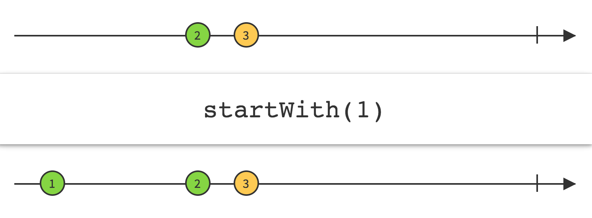
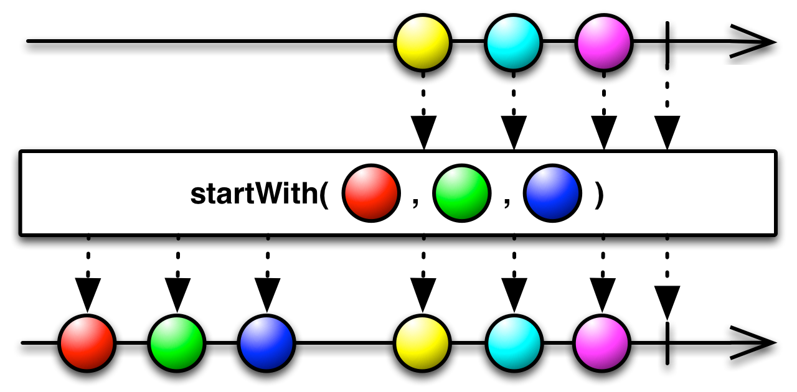

## StartWith

在数据序列的开头插入一条指定的项

如果你想要一个Observable在发射数据之前先发射一个指定的数据序列，可以使用`StartWith`操作符。（如果你想一个Observable发射的数据末尾追加一个数据序列可以使用`Concat`操作符。）

可接受一个Iterable或者多个Observable作为函数的参数。

* Javadoc: [startWith(Iterable)](http://reactivex.io/RxJava/javadoc/rx/Observable.html#startWith(java.lang.Iterable))
* Javadoc: [startWith(T)](http://reactivex.io/RxJava/javadoc/rx/Observable.html#startWith(T)) (最多接受九个参数)

你也可以传递一个Observable给`startWith`，它会将那个Observable的发射物插在原始Observable发射的数据序列之前，然后把这个当做自己的发射物集合。这可以看作是`Concat`的反转。

* Javadoc: [startWith(Observable)](http://reactivex.io/RxJava/javadoc/rx/Observable.html#startWith(rx.Observable))
