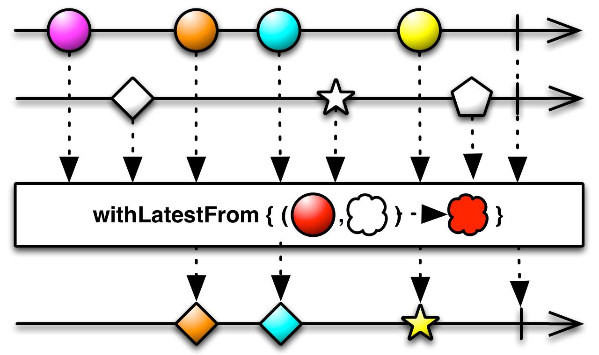

## CombineLatest

当两个Observables中的任何一个发射了数据时，使用一个函数结合每个Observable发射的最近数据项，并且基于这个函数的结果发射数据。

`CombineLatest`操作符行为类似于`zip`，但是只有当原始的Observable中的每一个都发射了一条数据时`zip`才发射数据。`CombineLatest`则在原始的Observable中任意一个发射了数据时发射一条数据。当原始Observables的任何一个发射了一条数据时，`CombineLatest`使用一个函数结合它们最近发射的数据，然后发射这个函数的返回值。

RxJava将这个操作符实现为`combineLatest`，它接受二到九个Observable作为参数，或者单个Observables列表作为参数。它默认不在任何特定的调度器上执行。

* Javadoc: [combineLatest(List,FuncN)](http://reactivex.io/RxJava/javadoc/rx/Observable.html#combineLatest(java.util.List,%20rx.functions.FuncN))
* Javadoc: [combineLatest(Observable,Observable,Func2)](http://reactivex.io/RxJava/javadoc/rx/Observable.html#combineLatest(rx.Observable,%20rx.Observable,%20rx.functions.Func2))

### withLatestFrom

`withLatestFrom`操作符还在开发中，不是1.0版本的一部分。类似于`combineLatest `，但是只在单个原始Observable发射了一条数据时才发射数据。
