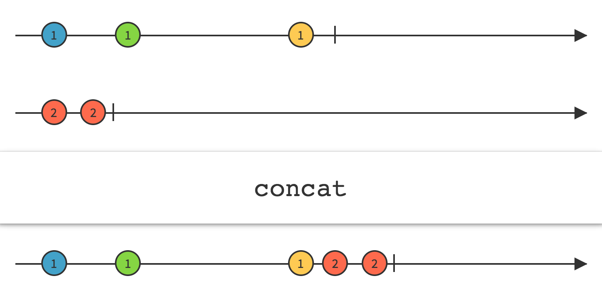
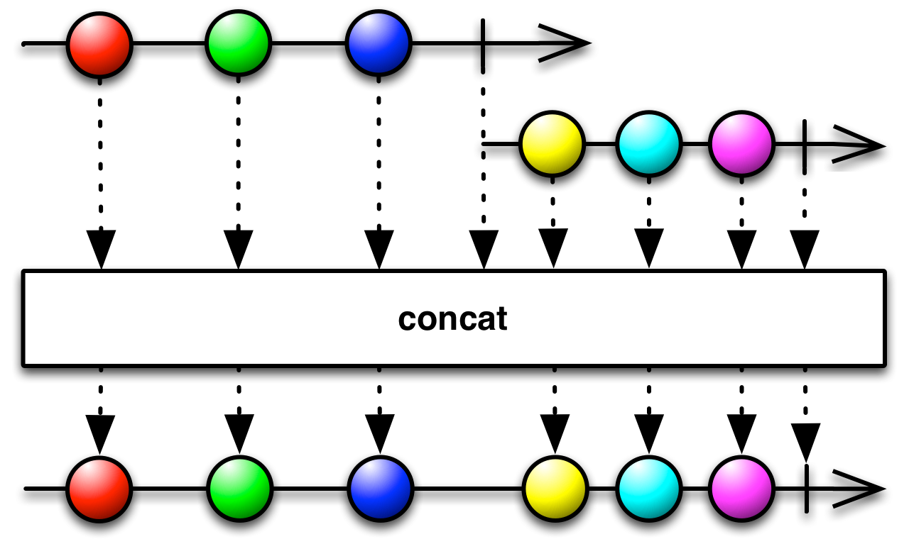

## Concat

不交错的发射两个或多个Observable的发射物

`Concat`操作符连接多个Observable的输出，就好像它们是一个Observable，第一个Observable发射的所有数据在第二个Observable发射的任何数据前面，以此类推。

直到前面一个Observable终止，`Concat`才会订阅额外的一个Observable。注意：因此，如果你尝试连接一个"热"Observable（这种Observable在创建后立即开始发射数据，即使没有订阅者），`Concat`将不会看到也不会发射它之前发射的任何数据。

在ReactiveX的某些实现中有一种`ConcatMap`操作符（名字可能叫`concat_all`, `concat_map`, `concatMapObserver`, `for`, `forIn/for_in`, `mapcat`, `selectConcat`或`selectConcatObserver`），他会变换原始Observable发射的数据到一个对应的Observable，然后再按观察和变换的顺序进行连接操作。

`StartWith`操作符类似于`Concat`，但是它是插入到前面，而不是追加那些Observable的数据到原始Observable发射的数据序列。

`Merge`操作符也差不多，它结合两个或多个Observable的发射物，但是数据可能交错，而`Concat`不会让多个Observable的发射物交错。

RxJava中的实现叫`concat`。

* Javadoc: [concat(Observable<Observable>)](http://reactivex.io/RxJava/javadoc/rx/Observable.html#concat(rx.Observable))
* Javadoc: [concat(Observable,Observable) ](http://reactivex.io/RxJava/javadoc/rx/Observable.html#concat(rx.Observable,%20rx.Observable))

还有一个实例方法叫`concatWith`，这两者是等价的：`Observable.concat(a,b)`和`a.concatWith(b)`。
