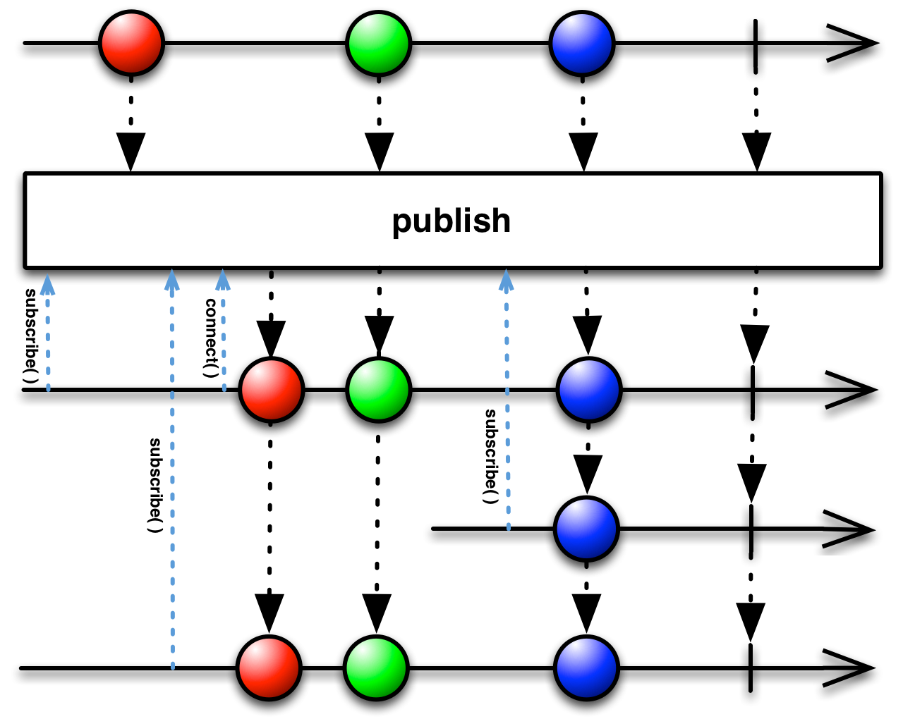

这一节解释[`ConnectableObservable`](http://reactivex.io/RxJava/javadoc/rx/observables/ConnectableObservable.html) 和它的子类以及它们的操作符：

* [**`ConnectableObservable.connect( )`**](Connect.md) — 指示一个可连接的Observable开始发射数据
* [**`Observable.publish( )`**](Publish.md) — 将一个Observable转换为一个可连接的Observable
* [**`Observable.replay( )`**](Replay.md) — 确保所有的订阅者看到相同的数据序列，即使它们在Observable开始发射数据之后才订阅
* [**`ConnectableObservable.refCount( )`**](RefCount.md) — 让一个可连接的Observable表现得像一个普通的Observable

一个可连接的Observable与普通的Observable差不多，除了这一点：可连接的Observable在被订阅时并不开始发射数据，只有在它的`connect()`被调用时才开始。用这种方法，你可以等所有的潜在订阅者都订阅了这个Observable之后才开始发射数据。



The following example code shows two Subscribers subscribing to the same Observable. In the first case, they subscribe to an ordinary Observable; in the second case, they subscribe to a Connectable Observable that only connects after both Subscribers subscribe. Note the difference in the output:
下面的示例代码展示了两个订阅者订阅同一个Observable的情况。第一种情形，它们订阅一个普通的Observable；第二种情形，它们订阅一个可连接的Observable，并且在两个都订阅后再连接。注意输出的不同：

**示例 #1:**

```groovy
def firstMillion  = Observable.range( 1, 1000000 ).sample(7, java.util.concurrent.TimeUnit.MILLISECONDS);

firstMillion.subscribe(
   { println("Subscriber #1:" + it); },       // onNext
   { println("Error: " + it.getMessage()); }, // onError
   { println("Sequence #1 complete"); }       // onCompleted
);

firstMillion.subscribe(
    { println("Subscriber #2:" + it); },       // onNext
    { println("Error: " + it.getMessage()); }, // onError
    { println("Sequence #2 complete"); }       // onCompleted
);
```

```
Subscriber #1:211128
Subscriber #1:411633
Subscriber #1:629605
Subscriber #1:841903
Sequence #1 complete
Subscriber #2:244776
Subscriber #2:431416
Subscriber #2:621647
Subscriber #2:826996
Sequence #2 complete
```

**示例 #2:**

```groovy
def firstMillion  = Observable.range( 1, 1000000 ).sample(7, java.util.concurrent.TimeUnit.MILLISECONDS).publish();

firstMillion.subscribe(
   { println("Subscriber #1:" + it); },       // onNext
   { println("Error: " + it.getMessage()); }, // onError
   { println("Sequence #1 complete"); }       // onCompleted
);

firstMillion.subscribe(
   { println("Subscriber #2:" + it); },       // onNext
   { println("Error: " + it.getMessage()); }, // onError
   { println("Sequence #2 complete"); }       // onCompleted
);

firstMillion.connect();
```

```
Subscriber #2:208683
Subscriber #1:208683
Subscriber #2:432509
Subscriber #1:432509
Subscriber #2:644270
Subscriber #1:644270
Subscriber #2:887885
Subscriber #1:887885
Sequence #2 complete
Sequence #1 complete
```

#### 参见：
* <a href="http://reactivex.io/RxJava/javadoc/rx/observables/ConnectableObservable.html">`ConnectableObservable`</a>
* <a href="http://www.introtorx.com/Content/v1.0.10621.0/14_HotAndColdObservables.html#PublishAndConnect">Introduction to Rx: Publish and Connect</a>
