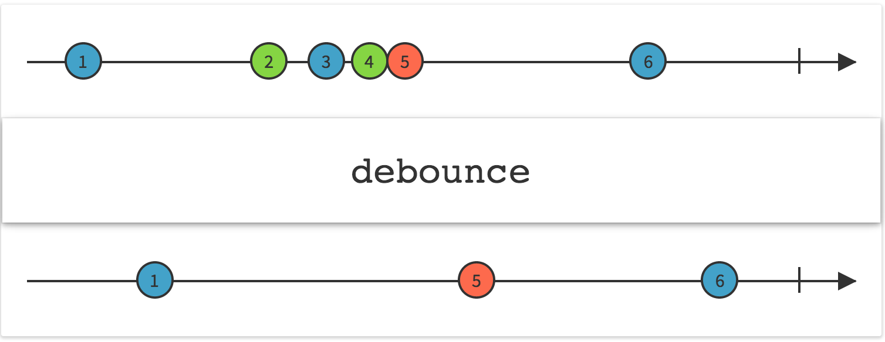
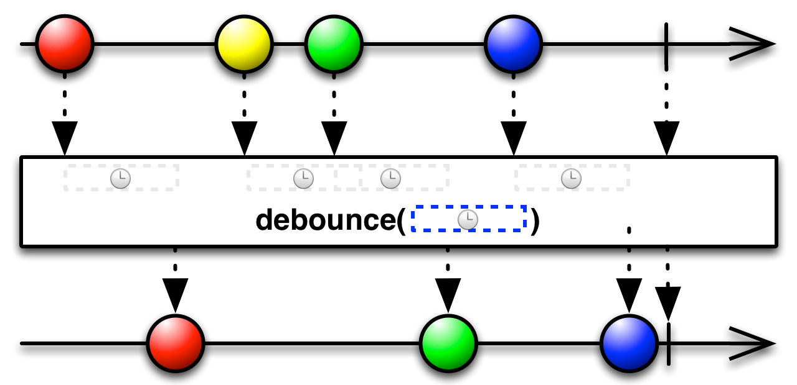

## Debounce

仅在过了一段指定的时间还没发射数据时才发射一个数据

`Debounce`操作符会过滤掉发射速率过快的数据项。

RxJava将这个操作符实现为`throttleWithTimeout`和`debounce`。

注意：这个操作符会会接着最后一项数据发射原始Observable的`onCompleted`通知，即使这个通知发生在你指定的时间窗口内（从最后一项数据的发射算起）。也就是说，`onCompleted`通知不会触发限流。

### throttleWithTimeout

`throtleWithTimeout/debounce`的一个变体根据你指定的时间间隔进行限流，时间单位通过`TimeUnit`参数指定。

这种操作符默认在`computation`调度器上执行，但是你可以通过第三个参数指定。

* Javadoc: [throttleWithTimeout(long,TimeUnit)](http://reactivex.io/RxJava/javadoc/rx/Observable.html#throttleWithTimeout(long,%20java.util.concurrent.TimeUnit)) and [debounce(long,TimeUnit)](http://reactivex.io/RxJava/javadoc/rx/Observable.html#debounce(long,%20java.util.concurrent.TimeUnit))
* Javadoc: [throttleWithTimeout(long,TimeUnit,Scheduler)](http://reactivex.io/RxJava/javadoc/rx/Observable.html#throttleWithTimeout(long,%20java.util.concurrent.TimeUnit,%20rx.Scheduler)) and [debounce(long,TimeUnit,Scheduler)](http://reactivex.io/RxJava/javadoc/rx/Observable.html#debounce(long,%20java.util.concurrent.TimeUnit,%20rx.Scheduler))

### debounce

`debounce`操作符的一个变体通过对原始Observable的每一项应用一个函数进行限流，这个函数返回一个Observable。如果原始Observable在这个新生成的Observable终止之前发射了另一个数据，`debounce`会抑制(suppress)这个数据项。

`debounce`的这个变体默认不在任何特定的调度器上执行。
