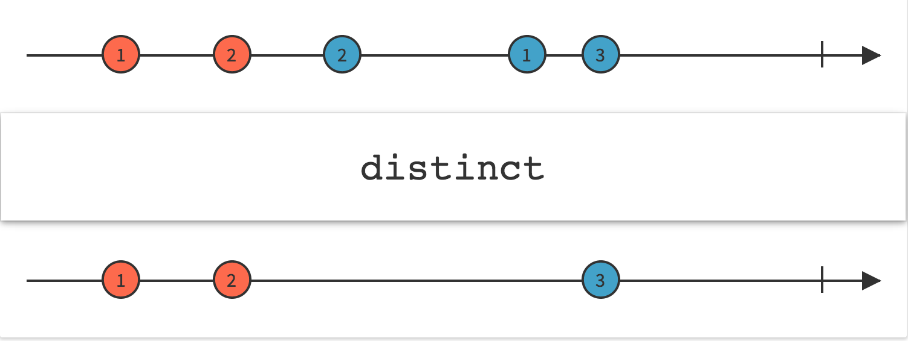
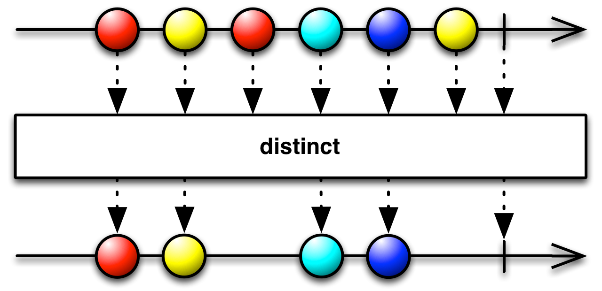
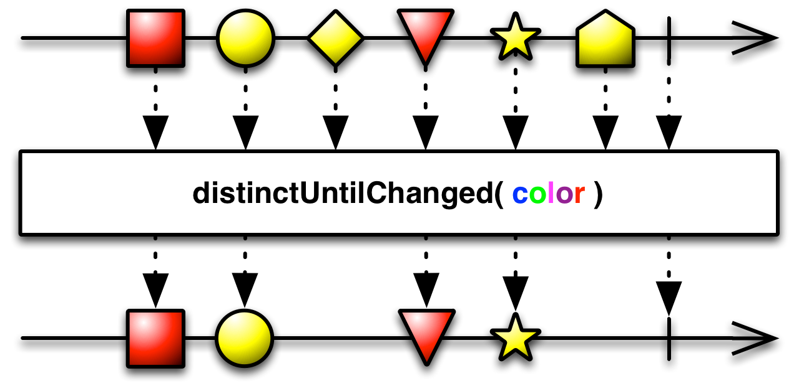

## Distinct

抑制（过滤掉）重复的数据项



`Distinct`的过滤规则是：只允许还没有发射过的数据项通过。

在某些实现中，有一些变体允许你调整判定两个数据不同(`distinct`)的标准。还有一些实现只比较一项数据和它的直接前驱，因此只会从序列中过滤掉连续重复的数据。

### distinct()



RxJava将这个操作符实现为`distinct`函数。

示例代码

```java

Observable.just(1, 2, 1, 1, 2, 3)
          .distinct()
          .subscribe(new Subscriber<Integer>() {
        @Override
        public void onNext(Integer item) {
            System.out.println("Next: " + item);
        }

        @Override
        public void onError(Throwable error) {
            System.err.println("Error: " + error.getMessage());
        }

        @Override
        public void onCompleted() {
            System.out.println("Sequence complete.");
        }
    });

```

输出

```
Next: 1
Next: 2
Next: 3
Sequence complete.
```

* Javadoc: [distinct()](http://reactivex.io/RxJava/javadoc/rx/Observable.html#distinct())

### distinct(Func1)


这个操作符有一个变体接受一个函数。这个函数根据原始Observable发射的数据项产生一个Key，然后，比较这些Key而不是数据本身，来判定两个数据是否是不同的。

* Javadoc: [distinct(Func1)](http://reactivex.io/RxJava/javadoc/rx/Observable.html#distinct(rx.functions.Func1))

### distinctUntilChanged


RxJava还是实现了一个`distinctUntilChanged`操作符。它只判定一个数据和它的直接前驱是否是不同的。

### distinctUntilChanged(Func1)



和`distinct(Func1)`一样，根据一个函数产生的Key判定两个相邻的数据项是不是不同的。

* Javadoc: [distinctUntilChanged(Func1)](http://reactivex.io/RxJava/javadoc/rx/Observable.html#distinctUntilChanged(rx.functions.Func1))

`distinct`和`distinctUntilChanged`默认不在任何特定的调度器上执行。
