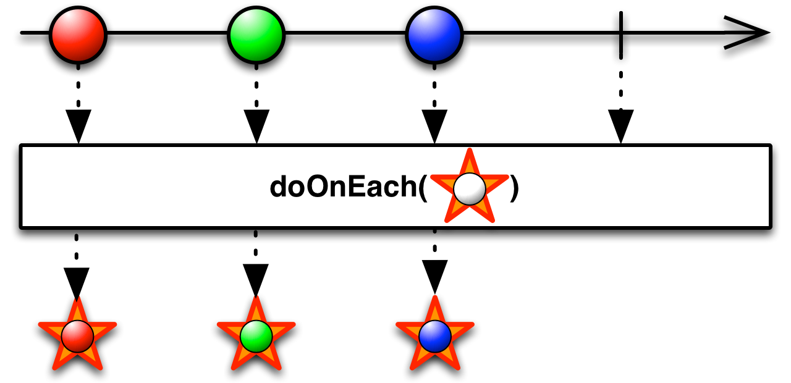
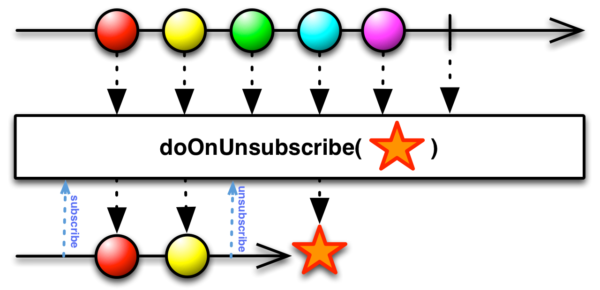
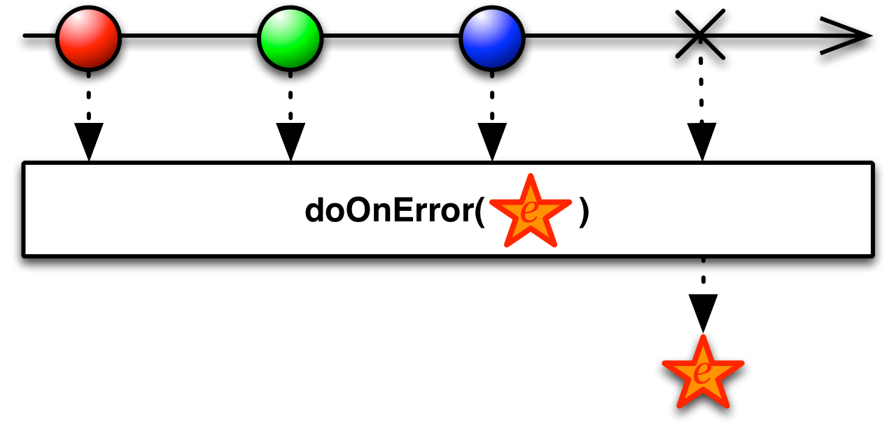
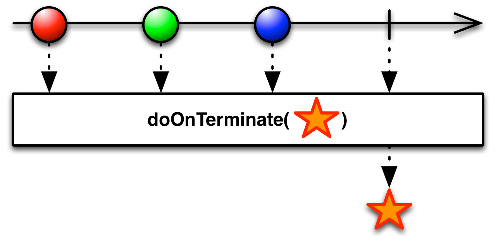

## Do

注册一个动作作为原始Observable生命周期事件的一种占位符


你可以注册回调，当Observable的某个事件发生时，Rx会在与Observable链关联的正常通知集合中调用它。Rx实现了多种操作符用于达到这个目的。

RxJava实现了很多`Do`操作符的变体。

### doOnEach



`doOnEach`操作符让你可以注册一个回调，它产生的Observable每发射一项数据就会调用它一次。你可以以`Action`的形式传递参数给它，这个Action接受一个`onNext`的变体`Notification`作为它的唯一参数，你也可以传递一个Observable给`doOnEach`，这个Observable的`onNext`会被调用，就好像它订阅了原始的Observable一样。

* Javadoc: [doOnEach(Action1)](http://reactivex.io/RxJava/javadoc/rx/Observable.html#doOnEach(rx.functions.Action1))
* Javadoc: [doOnEach(Observer)](http://reactivex.io/RxJava/javadoc/rx/Observable.html#doOnEach(rx.Observer))

### doOnNext


`doOnNext`操作符类似于`doOnEach(Action1)`，但是它的Action不是接受一个`Notification`参数，而是接受发射的数据项。

示例代码

```java

Observable.just(1, 2, 3)
          .doOnNext(new Action1<Integer>() {
          @Override
          public void call(Integer item) {
            if( item > 1 ) {
              throw new RuntimeException( "Item exceeds maximum value" );
            }
          }
        }).subscribe(new Subscriber<Integer>() {
        @Override
        public void onNext(Integer item) {
            System.out.println("Next: " + item);
        }

        @Override
        public void onError(Throwable error) {
            System.err.println("Error: " + error.getMessage());
        }

        @Override
        public void onCompleted() {
            System.out.println("Sequence complete.");
        }
    });

```

输出

```
Next: 1
Error: Item exceeds maximum value
```

### doOnSubscribe


`doOnSubscribe`操作符注册一个动作，当观察者订阅它生成的Observable它就会被调用。

* Javadoc: [doOnSubscribe(Action0)](http://reactivex.io/RxJava/javadoc/rx/Observable.html#doOnSubscribe(rx.functions.Action0))

### doOnUnsubscribe



`doOnUnsubscribe`操作符注册一个动作，当观察者取消订阅它生成的Observable它就会被调用。

* Javadoc: [doOnUnsubscribe(Action0)](http://reactivex.io/RxJava/javadoc/rx/Observable.html#doOnUnsubscribe(rx.functions.Action0))

### doOnCompleted


`doOnCompleted` 操作符注册一个动作，当它产生的Observable正常终止调用`onCompleted`时会被调用。

* Javadoc: [doOnCompleted(Action0)](http://reactivex.io/RxJava/javadoc/rx/Observable.html#doOnCompleted(rx.functions.Action0))

### doOnError



`doOnError` 操作符注册一个动作，当它产生的Observable异常终止调用`onError`时会被调用。

* Javadoc: [doOnError(Action0)](http://reactivex.io/RxJava/javadoc/rx/Observable.html#doOnError(rx.functions.Action1))

### doOnTerminate



`doOnTerminate` 操作符注册一个动作，当它产生的Observable终止之前会被调用，无论是正常还是异常终止。

* Javadoc: [doOnTerminate(Action0)](http://reactivex.io/RxJava/javadoc/rx/Observable.html#doOnTerminate(rx.functions.Action0))

### finallyDo


`finallyDo` 操作符注册一个动作，当它产生的Observable终止之后会被调用，无论是正常还是异常终止。

* Javadoc: [finallyDo(Action0)](http://reactivex.io/RxJava/javadoc/rx/Observable.html#finallyDo(rx.functions.Action0))
