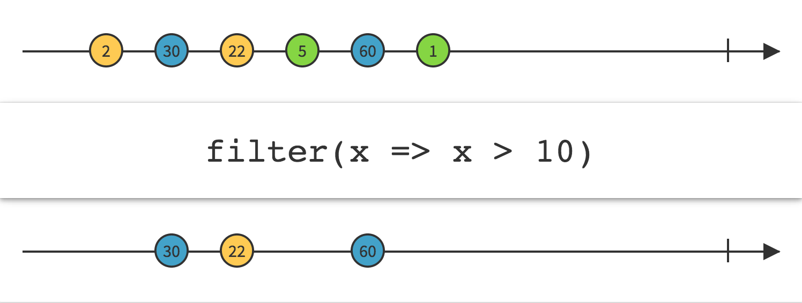
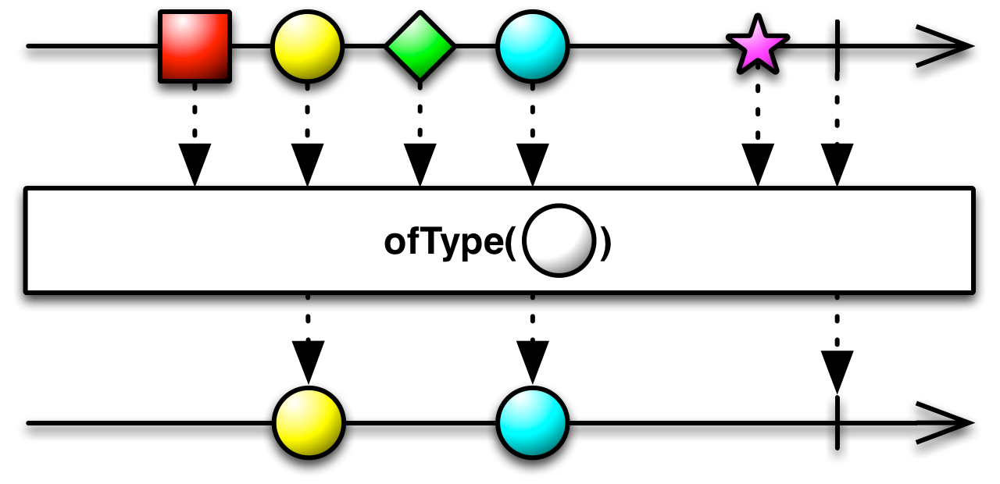

## Filter

只发射通过了谓词测试的数据项



`Filter`操作符使用你指定的一个谓词函数测试数据项，只有通过测试的数据才会被发射。


RxJava将这个操作符实现为`filter`函数。

示例代码

```java

Observable.just(1, 2, 3, 4, 5)
          .filter(new Func1<Integer, Boolean>() {
              @Override
              public Boolean call(Integer item) {
                return( item < 4 );
              }
          }).subscribe(new Subscriber<Integer>() {
        @Override
        public void onNext(Integer item) {
            System.out.println("Next: " + item);
        }

        @Override
        public void onError(Throwable error) {
            System.err.println("Error: " + error.getMessage());
        }

        @Override
        public void onCompleted() {
            System.out.println("Sequence complete.");
        }
    });

```

输出

```
Next: 1
Next: 2
Next: 3
Sequence complete.
```

`filter`默认不在任何特定的调度器上执行。

* Javadoc: [filter(Func1)](http://reactivex.io/RxJava/javadoc/rx/Observable.html#filter(rx.functions.Func1))

### ofType



`ofType`是`filter`操作符的一个特殊形式。它过滤一个Observable只返回指定类型的数据。

`ofType`默认不在任何特定的调度器上指定。

* Javadoc: [ofType(Class)](http://reactivex.io/RxJava/javadoc/rx/Observable.html#ofType(java.lang.Class))
