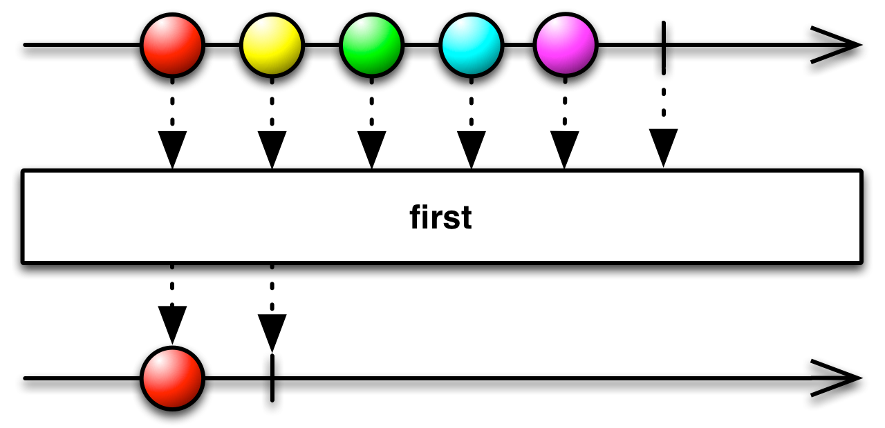
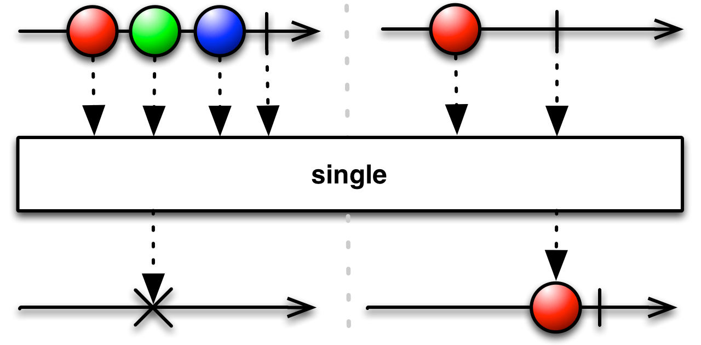
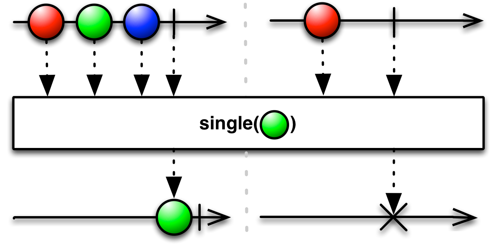
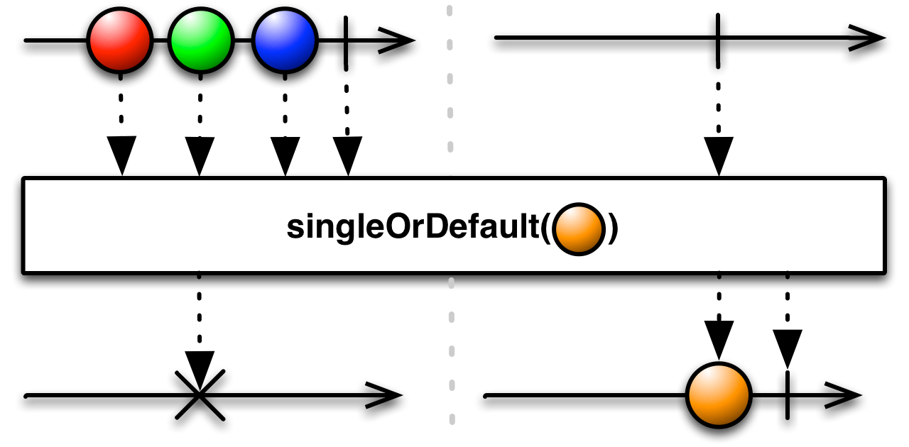

## First

只发射第一项（或者满足某个条件的第一项）数据


如果你只对Observable发射的第一项数据，或者满足某个条件的第一项数据感兴趣，你可以使用`First`操作符。

在某些实现中，`First`没有实现为一个返回Observable的过滤操作符，而是实现为一个在当时就发射原始Observable指定数据项的阻塞函数。在这些实现中，如果你想要的是一个过滤操作符，最好使用` Take(1)`或者`ElementAt(0)`。

在一些实现中还有一个`Single`操作符。它的行为与`First`类似，但为了确保只发射单个值，它会等待原始Observable终止（否则，不是发射那个值，而是以一个错误通知终止）。你可以使用它从原始Observable获取第一项数据，而且也确保只发射一项数据。

在RxJava中，这个操作符被实现为`first`，`firstOrDefault`和`takeFirst`。

可能容易混淆，`BlockingObservable`也有名叫`first`和`firstOrDefault`的操作符，它们会阻塞并返回值，不是立即返回一个Observable。

还有几个其它的操作符执行类似的功能。

### 过滤操作符



只发射第一个数据，使用没有参数的`first`操作符。

示例代码

```java
Observable.just(1, 2, 3)
          .first()
          .subscribe(new Subscriber<Integer>() {
        @Override
        public void onNext(Integer item) {
            System.out.println("Next: " + item);
        }

        @Override
        public void onError(Throwable error) {
            System.err.println("Error: " + error.getMessage());
        }

        @Override
        public void onCompleted() {
            System.out.println("Sequence complete.");
        }
    });
```

输出

```
Next: 1
Sequence complete.
```

* Javadoc: [first()](http://reactivex.io/RxJava/javadoc/rx/Observable.html#first())

### first(Func1)


传递一个谓词函数给`first`，然后发射这个函数判定为`true`的第一项数据。

* Javadoc: [first(Func1)](http://reactivex.io/RxJava/javadoc/rx/Observable.html#first(rx.functions.Func1))

### firstOrDefault


`firstOrDefault`与`first`类似，但是在Observagle没有发射任何数据时发射一个你在参数中指定的默认值。

* Javadoc: [firstOrDefault(T)](http://reactivex.io/RxJava/javadoc/rx/Observable.html#firstOrDefault(T))

### firstOrDefault(Func1)


传递一个谓词函数给`firstOrDefault `，然后发射这个函数判定为`true`的第一项数据，如果没有数据通过了谓词测试就发射一个默认值。

* Javadoc [firstOrDefault(T, Func1)](http://reactivex.io/RxJava/javadoc/rx/Observable.html#firstOrDefault(T, rx.functions.Func1))

### takeFirst


`takeFirst`与`first`类似，除了这一点：如果原始Observable没有发射任何满足条件的数据，`first`会抛出一个`NoSuchElementException`，`takeFist`会返回一个空的Observable（不调用`onNext()`但是会调用`onCompleted`）。

* Javadoc: [takeFirst(Func1)](http://reactivex.io/RxJava/javadoc/rx/Observable.html#takeFirst(rx.functions.Func1))

### single



`single`操作符也与`first`类似，但是如果原始Observable在完成之前不是正好发射一次数据，它会抛出一个`NoSuchElementException`。

* Javadoc: [single()](http://reactivex.io/RxJava/javadoc/rx/Observable.html#single())

### single(Func1)



`single`的变体接受一个谓词函数，发射满足条件的单个值，如果不是正好只有一个数据项满足条件，会以错误通知终止。

* Javadoc: [single(Func1)](http://reactivex.io/RxJava/javadoc/rx/Observable.html#single(rx.functions.Func1))

### singleOrDefault



和`firstOrDefault`类似，但是如果原始Observable发射超过一个的数据，会以错误通知终止。

* Javadoc: [singleOrDefault(T)](http://reactivex.io/RxJava/javadoc/rx/Observable.html#singleOrDefault(T))

### singleOrDefault(T,Func1)


和`firstOrDefault(T, Func1)`类似，如果没有数据满足条件，返回默认值；如果有多个数据满足条件，以错误通知终止。

* Javadoc: [singleOrDefault(Func1,T)](http://reactivex.io/RxJava/javadoc/rx/Observable.html#singleOrDefault(rx.functions.Func1,%20T))

first系列的这几个操作符默认不在任何特定的调度器上执行。
