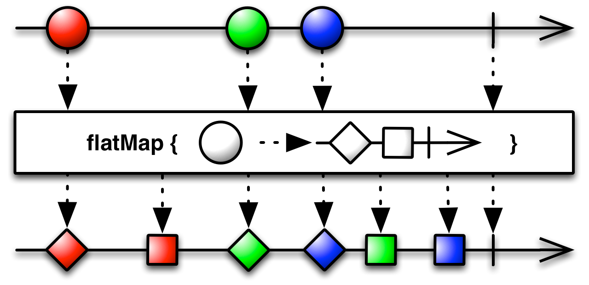
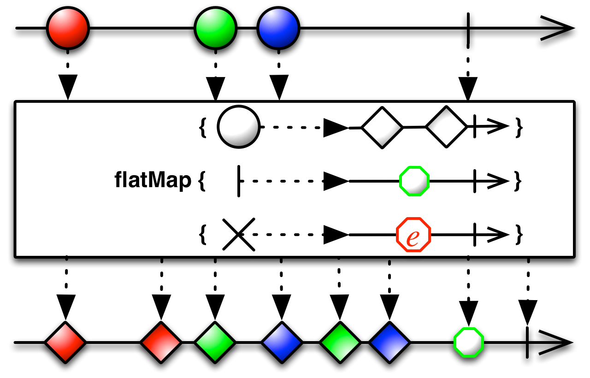

## FlatMap

`FlatMap`将一个发射数据的Observable变换为多个Observables，然后将它们发射的数据合并后放进一个单独的Observable

`FlatMap`操作符使用一个指定的函数对原始Observable发射的每一项数据执行变换操作，这个函数返回一个本身也发射数据的Observable，然后`FlatMap`合并这些Observables发射的数据，最后将合并后的结果当做它自己的数据序列发射。

这个方法是很有用的，例如，当你有一个这样的Observable：它发射一个数据序列，这些数据本身包含Observable成员或者可以变换为Observable，因此你可以创建一个新的Observable发射这些次级Observable发射的数据的完整集合。

注意：`FlatMap`对这些Observables发射的数据做的是合并(`merge`)操作，因此它们可能是交错的。

在许多语言特定的实现中，还有一个操作符不会让变换后的Observables发射的数据交错，它按照严格的顺序发射这些数据，这个操作符通常被叫作`ConcatMap`或者类似的名字。

RxJava将这个操作符实现为`flatMap`函数。

注意：如果任何一个通过这个`flatMap`操作产生的单独的Observable调用`onError`异常终止了，这个Observable自身会立即调用`onError`并终止。

这个操作符有一个接受额外的`int`参数的一个变体。这个参数设置`flatMap`从原来的Observable映射Observables的最大同时订阅数。当达到这个限制时，它会等待其中一个终止然后再订阅另一个。

* Javadoc: [flatMap(Func1)](http://reactivex.io/RxJava/javadoc/rx/Observable.html#flatMap(rx.functions.Func1))
* Javadoc: [flatMap(Func1,int)](http://reactivex.io/RxJava/javadoc/rx/Observable.html#flatMap(rx.functions.Func1,%20int))

还有一个版本的`flatMap`为原始Observable的每一项数据和每一个通知创建一个新的Observable（并对数据平坦化）。

它也有一个接受额外`int`参数的变体。

* Javadoc: [flatMap(Func1,Func1,Func0)](http://reactivex.io/RxJava/javadoc/rx/Observable.html#flatMap(rx.functions.Func1,%20rx.functions.Func1,%20rx.functions.Func0))
* Javadoc: [flatMap(Func1,Func1,Func0,int)](http://reactivex.io/RxJava/javadoc/rx/Observable.html#flatMap(rx.functions.Func1,%20rx.functions.Func1,%20rx.functions.Func0,%20int))

还有一个版本的`flatMap`会使用原始Observable的数据触发的Observable组合这些数据，然后发射这些数据组合。它也有一个接受额外`int`参数的版本。

* Javadoc: [flatMap(Func1,Func2)](http://reactivex.io/RxJava/javadoc/rx/Observable.html#flatMap(rx.functions.Func1,%20rx.functions.Func2))
* Javadoc: [flatMap(Func1,Func2,int)](http://reactivex.io/RxJava/javadoc/rx/Observable.html#flatMap(rx.functions.Func1,%20rx.functions.Func2,%20int))

### flatMapIterable

`flatMapIterable`这个变体成对的打包数据，然后生成Iterable而不是原始数据和生成的Observables，但是处理方式是相同的。

* Javadoc: [flatMapIterable(Func1)](http://reactivex.io/RxJava/javadoc/rx/Observable.html#flatMapIterable(rx.functions.Func1))
* Javadoc: [flatMapIterable(Func1,Func2)](http://reactivex.io/RxJava/javadoc/rx/Observable.html#flatMapIterable(rx.functions.Func1,%20rx.functions.Func2))

### concatMap

还有一个`concatMap`操作符，它类似于最简单版本的`flatMap`，但是它按次序连接而不是合并那些生成的Observables，然后产生自己的数据序列。

* Javadoc: [concatMap(Func1)](http://reactivex.io/RxJava/javadoc/rx/Observable.html#concatMap(rx.functions.Func1))

### switchMap

RxJava还实现了`switchMap`操作符。它和`flatMap`很像，除了一点：当原始Observable发射一个新的数据（Observable）时，它将取消订阅并停止监视产生执之前那个数据的Observable，只监视当前这一个。

* Javadoc: [switchMap(Func1)](http://reactivex.io/RxJava/javadoc/rx/Observable.html#switchMap(rx.functions.Func1))

### split

在特殊的`StringObservable`类（默认没有包含在RxJava中）中还有一个`split`操作符。它将一个发射字符串的Observable转换为另一个发射字符串的Observable，只不过，后者将原始的数据序列当做一个数据流，使用一个正则表达式边界分割它们，然后合并发射分割的结果。
