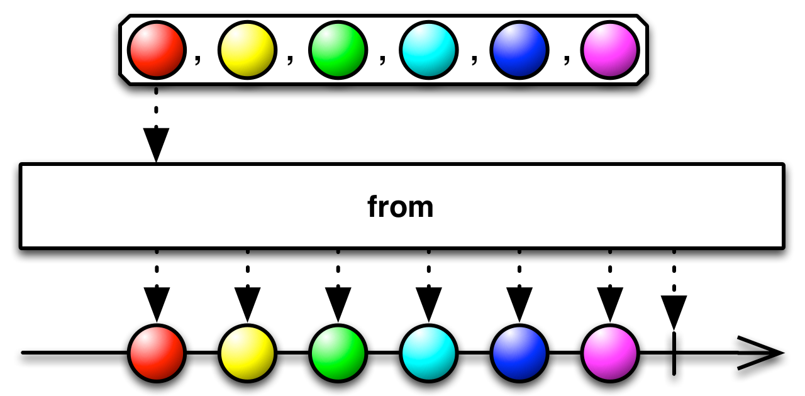
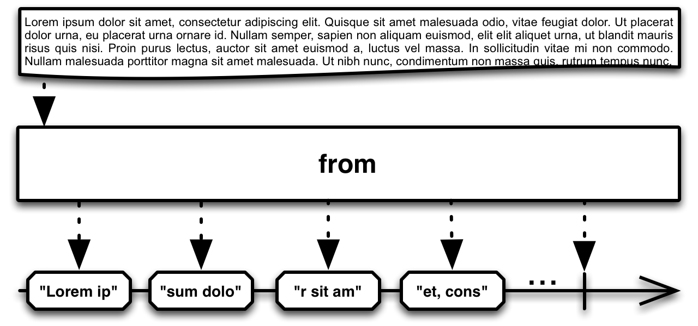

## From

将其它种类的对象和数据类型转换为Observable


当你使用Observable时，如果你要处理的数据都可以转换成展现为Observables，而不是需要混合使用Observables和其它类型的数据，会非常方便。这让你在数据流的整个生命周期中，可以使用一组统一的操作符来管理它们。

例如，Iterable可以看成是同步的Observable；Future，可以看成是总是只发射单个数据的Observable。通过显式地将那些数据转换为Observables，你可以像使用Observable一样与它们交互。

因此，大部分ReactiveX实现都提供了将语言特定的对象和数据结构转换为Observables的方法。



在RxJava中，`from`操作符可以转换Future、Iterable和数组。对于Iterable和数组，产生的Observable会发射Iterable或数组的每一项数据。

示例代码

```java

Integer[] items = { 0, 1, 2, 3, 4, 5 };
Observable myObservable = Observable.from(items);

myObservable.subscribe(
    new Action1<Integer>() {
        @Override
        public void call(Integer item) {
            System.out.println(item);
        }
    },
    new Action1<Throwable>() {
        @Override
        public void call(Throwable error) {
            System.out.println("Error encountered: " + error.getMessage());
        }
    },
    new Action0() {
        @Override
        public void call() {
            System.out.println("Sequence complete");
        }
    }
);

```

输出

```
0
1
2
3
4
5
Sequence complete
```

对于Future，它会发射Future.get()方法返回的单个数据。`from`方法有一个可接受两个可选参数的版本，分别指定超时时长和时间单位。如果过了指定的时长Future还没有返回一个值，这个Observable会发射错误通知并终止。

`from`默认不在任何特定的调度器上执行。然而你可以将Scheduler作为可选的第二个参数传递给Observable，它会在那个调度器上管理这个Future。

* Javadoc: [from(array)](http://reactivex.io/RxJava/javadoc/rx/Observable.html#from(T%5B%5D))
* Javadoc: [from(Iterable)](http://reactivex.io/RxJava/javadoc/rx/Observable.html#from(java.lang.Iterable))
* Javadoc: [from(Future)](http://reactivex.io/RxJava/javadoc/rx/Observable.html#from(java.util.concurrent.Future))
* Javadoc: [from(Future,Scheduler)](http://reactivex.io/RxJava/javadoc/rx/Observable.html#from(java.util.concurrent.Future,%20rx.Scheduler))
* Javadoc: [from(Future,timeout, timeUnit)](http://reactivex.io/RxJava/javadoc/rx/Observable.html#from(java.util.concurrent.Future,%20long,%20java.util.concurrent.TimeUnit))

### RxJavaAsyncUtil


此外，在可选包 `RxJavaAsyncUtil` 中，你还可以用下面这些操作符将actions，callables，functions和runnables转换为发射这些动作的执行结果的Observable：

* fromAction
* fromCallable
* fromFunc0
* fromRunnable

在这个页面 [Start](http://reactivex.io/documentation/operators/start.html) 查看关于这些操作符的更多信息。



注意：还有一个可选的`StringObservable`类中也有一个`from`方法，它将一个字符流或者一个REader转换为一个发射字节数组或字符串的Observable。

### runAsync2

注意：这里与后面`start`操作符里的`runAsync`说明重复了

在单独的`RxJavaAsyncUtil`包中（默认不包含在RxJava中）,还有一个`runAsync`函数。传递一个`Action`和一个`Scheduler`给`runAsync`，它会返回一个`StoppableObservable`，这个Observable使用`Action`产生发射的数据项。

传递一个`Action`和一个`Scheduler`给`runAsync`，它返回一个使用这个`Action`产生数据的`StoppableObservable`。这个`Action`接受一个`Observable`和一个`Subscription`作为参数，它使用`Subscription`检查`unsubscribed`条件，一旦发现条件为真就立即停止发射数据。在任何时候你都可以使用`unsubscribe`方法手动停止一个`StoppableObservable`（这会同时取消订阅与这个`StoppableObservable`关联的`Subscription`）。

由于`runAsync`会立即调用`Action`并开始发射数据，在你创建StoppableObservable之后到你的观察者准备好接受数据之前这段时间里，可能会有一部分数据会丢失。如果这不符合你的要求，可以使用`runAsync`的一个变体，它也接受一个`Subject`参数，传递一个`ReplaySubject`给它，你可以获取其它丢失的数据了。

### decode


`StringObservable`类不是默认RxJava的一部分，包含一个`decode`操作符，这个操作符将一个多字节字符流转换为一个发射字节数组的Observable，这些字节数组按照字符的边界划分。
