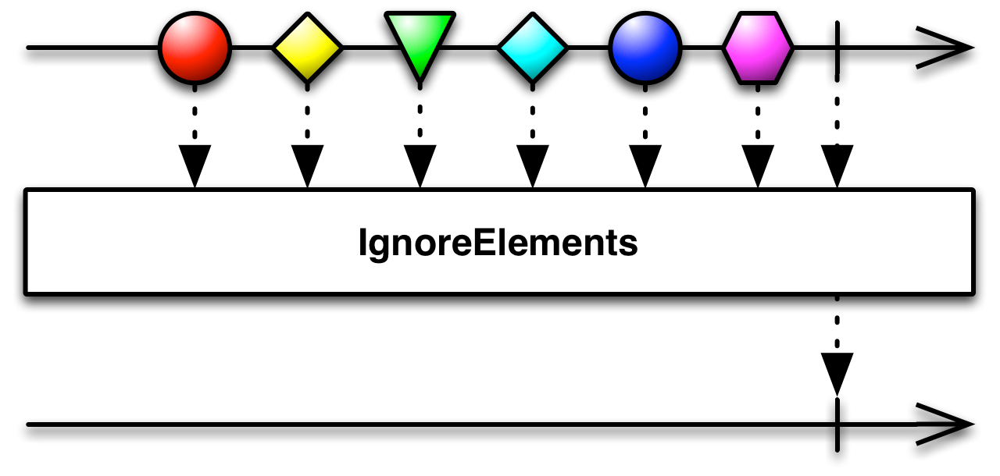

## IgnoreElements

不发射任何数据，只发射Observable的终止通知

`IgnoreElements`操作符抑制原始Observable发射的所有数据，只允许它的终止通知（`onError`或`onCompleted`）通过。

如果你不关心一个Observable发射的数据，但是希望在它完成时或遇到错误终止时收到通知，你可以对Observable使用`ignoreElements`操作符，它会确保永远不会调用观察者的`onNext()`方法。

RxJava将这个操作符实现为`ignoreElements`。

* Javadoc: [ignoreElements()](http://reactivex.io/RxJava/javadoc/rx/Observable.html#ignoreElements())

`ignoreElements`默认不在任何特定的调度器上执行。
