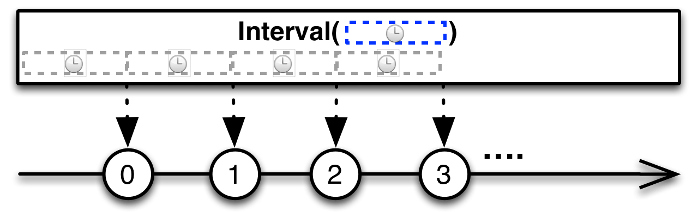
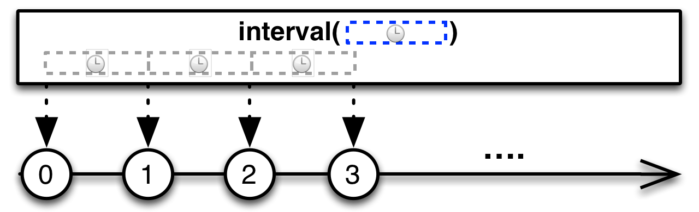

## Interval

创建一个按固定时间间隔发射整数序列的Observable

`Interval`操作符返回一个Observable，它按固定的时间间隔发射一个无限递增的整数序列。

RxJava将这个操作符实现为`interval`方法。它接受一个表示时间间隔的参数和一个表示时间单位的参数。

* Javadoc: [interval(long,TimeUnit)](http://reactivex.io/RxJava/javadoc/rx/Observable.html#interval(long,%20java.util.concurrent.TimeUnit))
* Javadoc: [interval(long,TimeUnit,Scheduler)](http://reactivex.io/RxJava/javadoc/rx/Observable.html#interval(long,%20java.util.concurrent.TimeUnit%20rx.Scheduler))

还有一个版本的`interval`返回一个Observable，它在指定延迟之后先发射一个零值，然后再按照指定的时间间隔发射递增的数字。这个版本的`interval`在RxJava 1.0.0中叫做`timer`，但是那个方法已经不建议使用了，因为一个名叫`interval`的操作符有同样的功能。

Javadoc: [interval(long,long,TimeUnit)](http://reactivex.io/RxJava/javadoc/rx/Observable.html#interval(long,%20long,%20java.util.concurrent.TimeUnit))
Javadoc: [interval(long,long,TimeUnit,Scheduler)](http://reactivex.io/RxJava/javadoc/rx/Observable.html#interval(long,%20long,%20java.util.concurrent.TimeUnit,%20rx.Scheduler))

`interval`默认在`computation`调度器上执行。你也可以传递一个可选的Scheduler参数来指定调度器。
