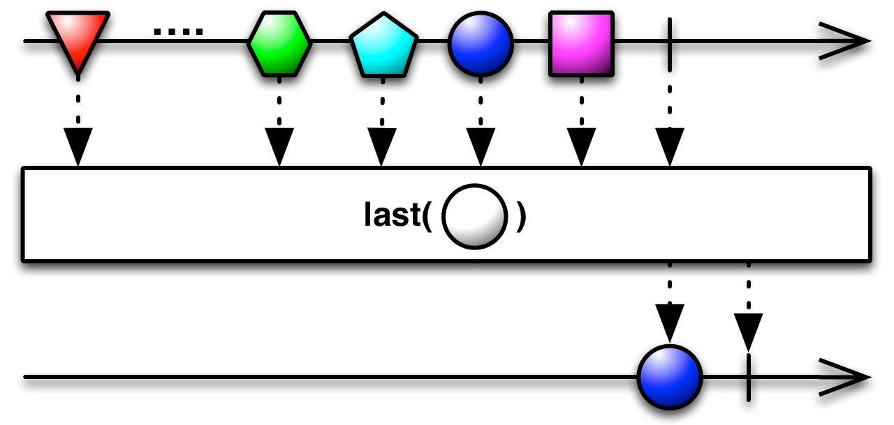
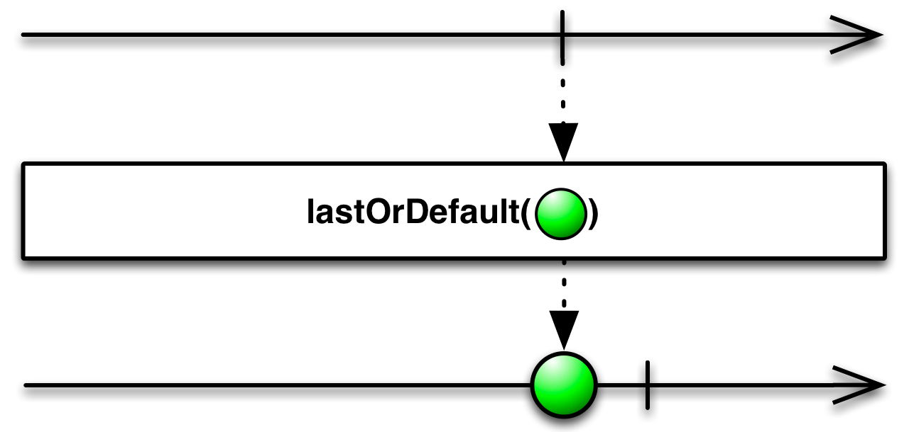
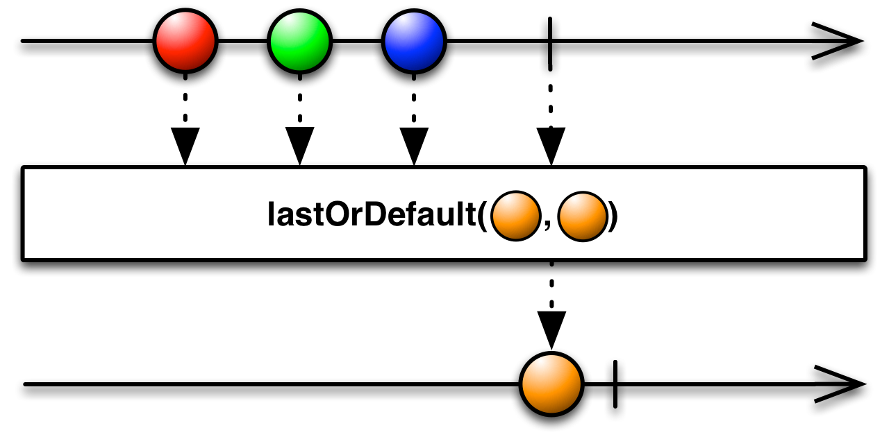

## Last

只发射最后一项（或者满足某个条件的最后一项）数据


如果你只对Observable发射的最后一项数据，或者满足某个条件的最后一项数据感兴趣，你可以使用`Last`操作符。

在某些实现中，`Last `没有实现为一个返回Observable的过滤操作符，而是实现为一个在当时就发射原始Observable指定数据项的阻塞函数。在这些实现中，如果你想要的是一个过滤操作符，最好使用`TakeLast(1)`。

在RxJava中的实现是`last`和`lastOrDefault`。

可能容易混淆，`BlockingObservable`也有名叫`last `和`lastOrDefault `的操作符，它们会阻塞并返回值，不是立即返回一个Observable。

### 过滤操作符


只发射最后一项数据，使用没有参数的`last `操作符。

示例代码

```java
Observable.just(1, 2, 3)
          .last()
          .subscribe(new Subscriber<Integer>() {
        @Override
        public void onNext(Integer item) {
            System.out.println("Next: " + item);
        }

        @Override
        public void onError(Throwable error) {
            System.err.println("Error: " + error.getMessage());
        }

        @Override
        public void onCompleted() {
            System.out.println("Sequence complete.");
        }
    });
```

输出

```
Next: 3
Sequence complete.
```

* Javadoc: [last()](http://reactivex.io/RxJava/javadoc/rx/Observable.html#last())



这个版本的`last`也是接受一个谓词函数，返回一个发射原始Observable中满足条件的最后一项数据的Observable。

* Javadoc: [last(Func1)](http://reactivex.io/RxJava/javadoc/rx/Observable.html#last(rx.functions.Func1))



`lastOrDefault`与`last`类似，不同的是，如果原始Observable没有发射任何值，它发射你指定的默认值。

* Javadoc: [lastOrDefault(T)](http://reactivex.io/RxJava/javadoc/rx/Observable.html#lastOrDefault(T))



这个版本的`lastOrDefault`可以接受一个谓词函数，如果有数据满足条件，返回的Observable就发射原始Observable满足条件的最后一项数据，否则发射默认值。

* Javadoc: [lastOrDefault(T)](http://reactivex.io/RxJava/javadoc/rx/Observable.html#lastOrDefault(T))

`last`和`lastOrDefault`默认不在任何特定的调度器上执行。

