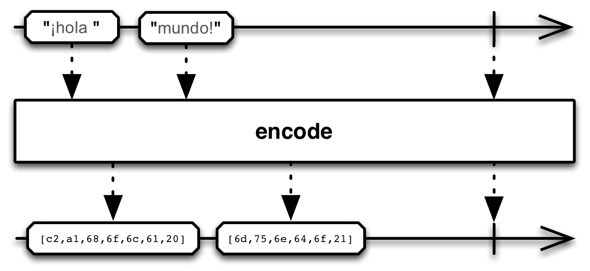
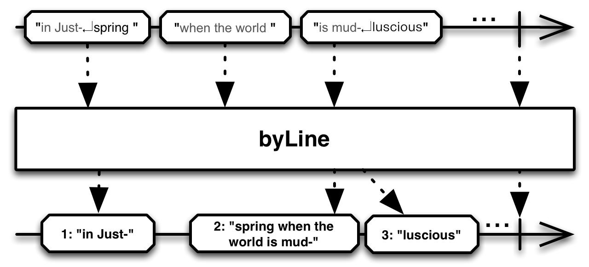

## Map

对Observable发射的每一项数据应用一个函数，执行变换操作

`Map`操作符对原始Observable发射的每一项数据应用一个你选择的函数，然后返回一个发射这些结果的Observable。

RxJava将这个操作符实现为`map`函数。这个操作符默认不在任何特定的调度器上执行。

* Javadoc: [map(Func1)](http://reactivex.io/RxJava/javadoc/rx/Observable.html#map(rx.functions.Func1))

### cast

`cast`操作符将原始Observable发射的每一项数据都强制转换为一个指定的类型，然后再发射数据，它是`map`的一个特殊版本。

* Javadoc: [cast(Class)](http://reactivex.io/RxJava/javadoc/rx/Observable.html#cast(java.lang.Class))

### encode

`encode`在`StringObservable`类中，不是标准RxJava的一部分，它也是一个特殊的`map`操作符。`encode`将一个发射字符串的Observable变换为一个发射字节数组（这个字节数组按照原始字符串中的多字节字符边界划分）的Observable。

### byLine

`byLine `同样在`StringObservable`类中，也不是标准RxJava的一部分，它也是一个特殊的`map`操作符。`byLine`将一个发射字符串的Observable变换为一个按行发射来自原始Observable的字符串的Observable。
