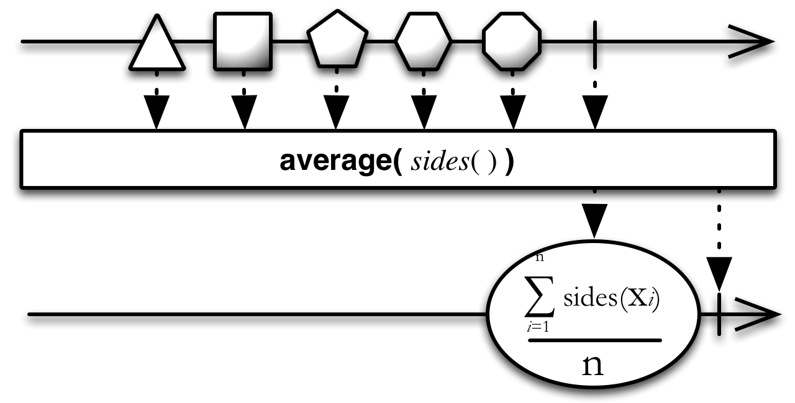

# 算术和聚合操作

## Average

计算原始Observable发射数字的平均值并发射它


`Average`操作符操作符一个发射数字的Observable，并发射单个值：原始Observable发射的数字序列的平均值。

这个操作符不包含在RxJava核心模块中，它属于不同的`rxjava-math`模块。它被实现为四个操作符：`averageDouble`, `averageFloat`, `averageInteger`, `averageLong`。



如果原始Observable不发射任何数据，这个操作符会抛异常：`IllegalArgumentException `。


## Min

发射原始Observable的最小值


`Min`操作符操作一个发射数值的Observable并发射单个值：最小的那个值。

RxJava中，`min`属于`rxjava-math`模块。


`min`接受一个可选参数，用于比较两项数据的大小，如果最小值的数据超过一项，`min`会发射原始Observable最近发射的那一项。


`minBy`类似于`min`，但是它发射的不是最小值，而是发射Key最小的项，Key由你指定的一个函数生成。

## Max

发射原始Observable的最大值


`Max `操作符操作一个发射数值的Observable并发射单个值：最大的那个值。

RxJava中，`max`属于`rxjava-math`模块。


`max `接受一个可选参数，用于比较两项数据的大小，如果最大值的数据超过一项，`max `会发射原始Observable最近发射的那一项。


`maxBy `类似于`max`，但是它发射的不是最大值，而是发射Key最大的项，Key由你指定的一个函数生成。

## Count

计算原始Observable发射物的数量，然后只发射这个值


`Count`操作符将一个Observable转换成一个发射单个值的Observable，这个值表示原始Observable发射的数据的数量。

如果原始Observable发生错误终止，`Count`不发射数据而是直接传递错误通知。如果原始Observable永远不终止，`Count`既不会发射数据也不会终止。

RxJava的实现是`count`和`countLong`。

示例代码

```java

String[] items = new String[] { "one", "two", "three" };
assertEquals( new Integer(3), Observable.from(items).count().toBlocking().single() );

```

* Javadoc: [count()](http://reactivex.io/RxJava/javadoc/rx/Observable.html#count())
* Javadoc: [countLong()](http://reactivex.io/RxJava/javadoc/rx/Observable.html#countLong())


## Sum

计算Observable发射的数值的和并发射这个和


`Sum`操作符操作一个发射数值的Observable，仅发射单个值：原始Observable所有数值的和。

RxJava的实现是`sumDouble`, `sumFloat`, `sumInteger`, `sumLong`，它们不是RxJava核心模块的一部分，属于`rxjava-math`模块。


你可以使用一个函数，计算Observable每一项数据的函数返回值的和。

在`StringObservable`类（这个类不是RxJava核心模块的一部分）中有一个`stringConcat`操作符，它将一个发射字符串序列的Observable转换为一个发射单个字符串的Observable，后者这个字符串表示的是前者所有字符串的连接。


`StringObservable`类还有一个`join`操作符，它将一个发射字符串序列的Observable转换为一个发射单个字符串的Observable，后者这个字符串表示的是前者所有字符串以你指定的分界符连接的结果。


## Concat

不交错的发射两个或多个Observable的发射物


`Concat`操作符连接多个Observable的输出，就好像它们是一个Observable，第一个Observable发射的所有数据在第二个Observable发射的任何数据前面，以此类推。

直到前面一个Observable终止，`Concat`才会订阅额外的一个Observable。注意：因此，如果你尝试连接一个"热"Observable（这种Observable在创建后立即开始发射数据，即使没有订阅者），`Concat`将不会看到也不会发射它之前发射的任何数据。

在ReactiveX的某些实现中有一种`ConcatMap`操作符（名字可能叫`concat_all`, `concat_map`, `concatMapObserver`, `for`, `forIn/for_in`, `mapcat`, `selectConcat`或`selectConcatObserver`），他会变换原始Observable发射的数据到一个对应的Observable，然后再按观察和变换的顺序进行连接操作。

`StartWith`操作符类似于`Concat`，但是它是插入到前面，而不是追加那些Observable的数据到原始Observable发射的数据序列。

`Merge`操作符也差不多，它结合两个或多个Observable的发射物，但是数据可能交错，而`Concat`不会让多个Observable的发射物交错。


RxJava中的实现叫`concat`。

* Javadoc: [concat(Observable<Observable>)](http://reactivex.io/RxJava/javadoc/rx/Observable.html#concat(rx.Observable))
* Javadoc: [concat(Observable,Observable) ](http://reactivex.io/RxJava/javadoc/rx/Observable.html#concat(rx.Observable,%20rx.Observable))

还有一个实例方法叫`concatWith`，这两者是等价的：`Observable.concat(a,b)`和`a.concatWith(b)`。


## Reduce

按顺序对Observable发射的每项数据应用一个函数并发射最终的值


`Reduce`操作符对原始Observable发射数据的第一项应用一个函数，然后再将这个函数的返回值与第二项数据一起传递给函数，以此类推，持续这个过程知道原始Observable发射它的最后一项数据并终止，此时`Reduce`返回的Observable发射这个函数返回的最终值。

在其它场景中，这种操作有时被称为`累积`，`聚集`，`压缩`，`折叠`，`注射`等。


注意如果原始Observable没有发射任何数据，`reduce`抛出异常`IllegalArgumentException`。

`reduce`默认不在任何特定的调度器上执行。

* Javadoc: [reduce(Func2)](http://reactivex.io/RxJava/javadoc/rx/Observable.html#reduce(rx.functions.Func2))


还有一个版本的`reduce`额外接受一个种子参数。注意传递一个值为`null`的种子是合法的，但是与不传种子参数的行为是不同的。如果你传递了种子参数，并且原始Observable没有发射任何数据，`reduce`操作符将发射这个种子值然后正常终止，而不是抛异常。

* Javadoc: [reduce(R,Func2)](http://reactivex.io/RxJava/javadoc/rx/Observable.html#reduce(R,%20rx.functions.Func2))

提示：不建议使用`reduce`收集发射的数据到一个可变的数据结构，那种场景你应该使用`collect`。


`collect`与`reduce`类似，但它的目的是收集原始Observable发射的所有数据到一个可变的数据结构，`collect`生成的这个Observable会发射这项数据。它需要两个参数：

1. 一个函数返回可变数据结构
2. 另一个函数，当传递给它这个数据结构和原始Observable发射的数据项时，适当地修改数据结构。

`collect`默认不在任何特定的调度器上执行。

* Javadoc: [collect(Func0,Action2)](http://reactivex.io/RxJava/javadoc/rx/Observable.html#collect(rx.functions.Func0,%20rx.functions.Action2))
