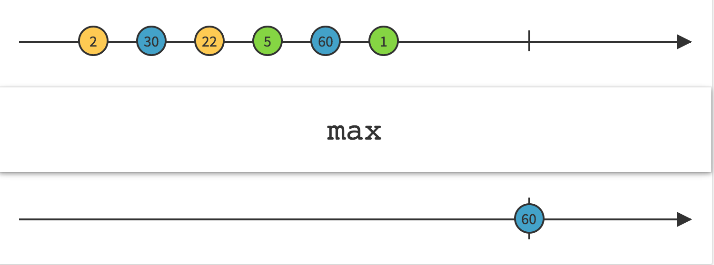
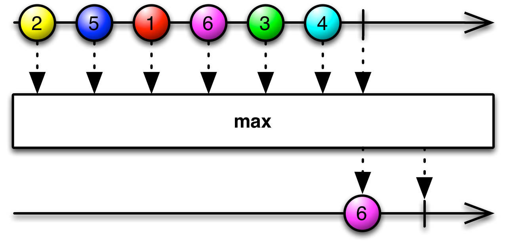
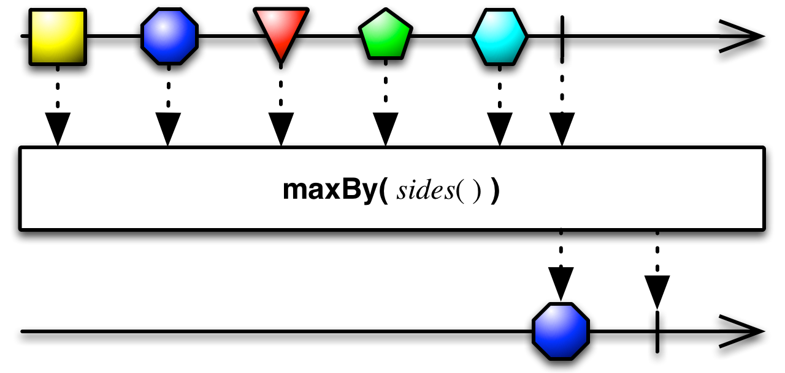

## Max

发射原始Observable的最大值

`Max `操作符操作一个发射数值的Observable并发射单个值：最大的那个值。

RxJava中，`max`属于`rxjava-math`模块。

`max `接受一个可选参数，用于比较两项数据的大小，如果最大值的数据超过一项，`max `会发射原始Observable最近发射的那一项。

`maxBy `类似于`max`，但是它发射的不是最大值，而是发射Key最大的项，Key由你指定的一个函数生成。
