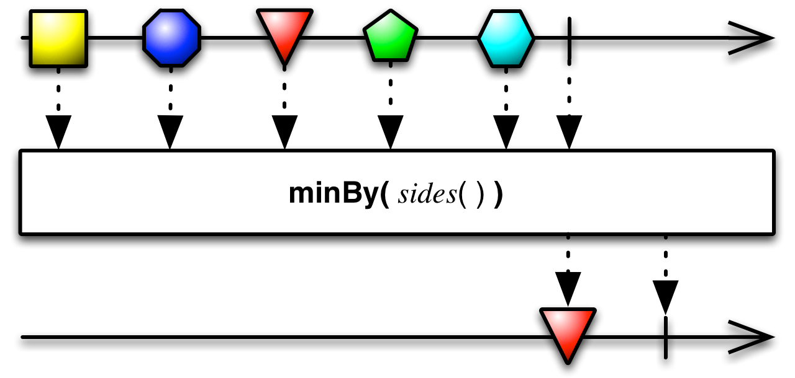

## Min

发射原始Observable的最小值

`Min`操作符操作一个发射数值的Observable并发射单个值：最小的那个值。

RxJava中，`min`属于`rxjava-math`模块。

`min`接受一个可选参数，用于比较两项数据的大小，如果最小值的数据超过一项，`min`会发射原始Observable最近发射的那一项。

`minBy`类似于`min`，但是它发射的不是最小值，而是发射Key最小的项，Key由你指定的一个函数生成。
