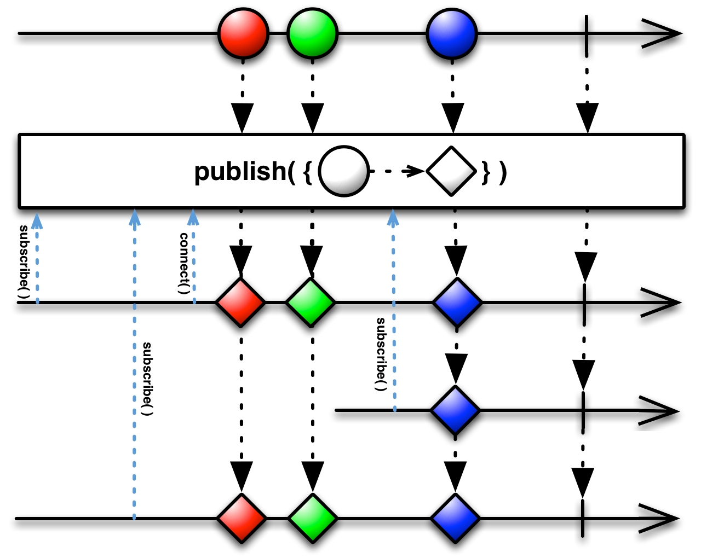

## Publish

将普通的Observable转换为可连接的Observable

可连接的Observable (*connectable Observable*)与普通的Observable差不多，不过它并不会在被订阅时开始发射数据，而是直到使用了`Connect`操作符时才会开始。用这种方法，你可以在任何时候让一个Observable开始发射数据。

RxJava的实现为`publish`。

* Javadoc: [publish()](http://reactivex.io/RxJava/javadoc/rx/Observable.html#publish())

有一个变体接受一个函数作为参数。这个函数用原始Observable发射的数据作为参数，产生一个新的数据作为`ConnectableObservable`给发射，替换原位置的数据项。实质是在签名的基础上添加一个`Map`操作。

* Javadoc: [publish(Func1)](http://reactivex.io/RxJava/javadoc/rx/Observable.html#publish(rx.functions.Func1))

