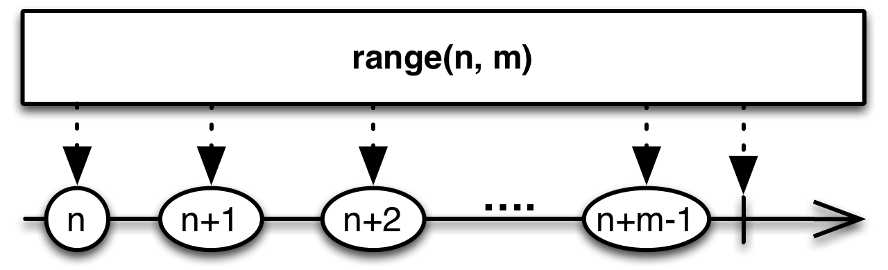

## Range

创建一个发射特定整数序列的Observable

Range操作符发射一个范围内的有序整数序列，你可以指定范围的起始和长度。

RxJava将这个操作符实现为`range`函数，它接受两个参数，一个是范围的起始值，一个是范围的数据的数目。如果你将第二个参数设为0，将导致Observable不发射任何数据（如果设置为负数，会抛异常）。

`range`默认不在任何特定的调度器上执行。有一个变体可以通过可选参数指定Scheduler。

* Javadoc: [range(int,int)](http://reactivex.io/RxJava/javadoc/rx/Observable.html#range(int,%20int))
* Javadoc: [range(int,int,Scheduler)](http://reactivex.io/RxJava/javadoc/rx/Observable.html#range(int,%20int%20rx.Scheduler))
