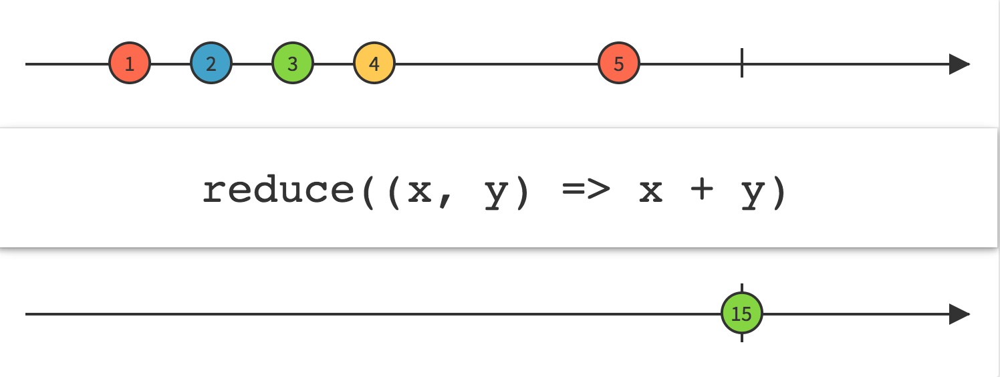
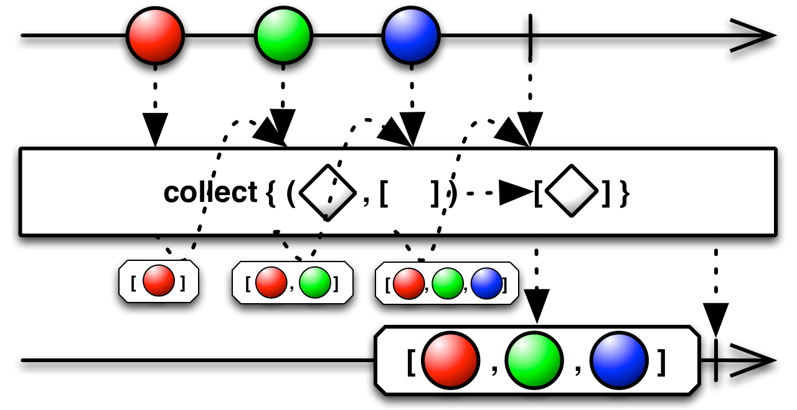

## Reduce

按顺序对Observable发射的每项数据应用一个函数并发射最终的值

`Reduce`操作符对原始Observable发射数据的第一项应用一个函数，然后再将这个函数的返回值与第二项数据一起传递给函数，以此类推，持续这个过程知道原始Observable发射它的最后一项数据并终止，此时`Reduce`返回的Observable发射这个函数返回的最终值。

在其它场景中，这种操作有时被称为`累积`，`聚集`，`压缩`，`折叠`，`注射`等。

注意如果原始Observable没有发射任何数据，`reduce`抛出异常`IllegalArgumentException`。

`reduce`默认不在任何特定的调度器上执行。

* Javadoc: [reduce(Func2)](http://reactivex.io/RxJava/javadoc/rx/Observable.html#reduce(rx.functions.Func2))

还有一个版本的`reduce`额外接受一个种子参数。注意传递一个值为`null`的种子是合法的，但是与不传种子参数的行为是不同的。如果你传递了种子参数，并且原始Observable没有发射任何数据，`reduce`操作符将发射这个种子值然后正常终止，而不是抛异常。

* Javadoc: [reduce(R,Func2)](http://reactivex.io/RxJava/javadoc/rx/Observable.html#reduce(R,%20rx.functions.Func2))

提示：不建议使用`reduce`收集发射的数据到一个可变的数据结构，那种场景你应该使用`collect`。

`collect`与`reduce`类似，但它的目的是收集原始Observable发射的所有数据到一个可变的数据结构，`collect`生成的这个Observable会发射这项数据。它需要两个参数：

1. 一个函数返回可变数据结构
2. 另一个函数，当传递给它这个数据结构和原始Observable发射的数据项时，适当地修改数据结构。

`collect`默认不在任何特定的调度器上执行。

* Javadoc: [collect(Func0,Action2)](http://reactivex.io/RxJava/javadoc/rx/Observable.html#collect(rx.functions.Func0,%20rx.functions.Action2))
