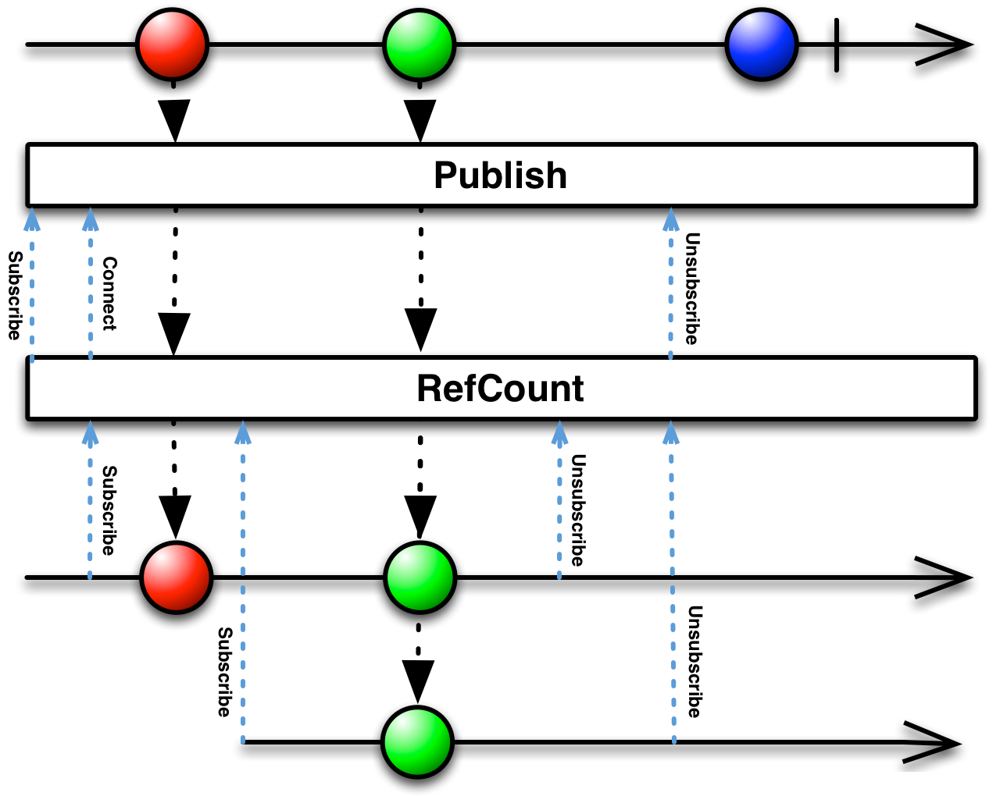

## RefCount

让一个可连接的Observable行为像普通的Observable

可连接的Observable (*connectable Observable*)与普通的Observable差不多，不过它并不会在被订阅时开始发射数据，而是直到使用了`Connect`操作符时才会开始。用这种方法，你可以在任何时候让一个Observable开始发射数据。

`RefCount`操作符把从一个可连接的Observable连接和断开的过程自动化了。它操作一个可连接的Observable，返回一个普通的Observable。当第一个订阅者订阅这个Observable时，`RefCount`连接到下层的可连接Observable。`RefCount`跟踪有多少个观察者订阅它，直到最后一个观察者完成才断开与下层可连接Observable的连接。

RxJava中的实现为`refCount`，还有一个操作符叫`share`，它的作用等价于对一个Observable同时应用`publish`和`refCount`操作。

* Javadoc: [refCount()](http://reactivex.io/RxJava/javadoc/rx/observables/ConnectableObservable.html#refCount())
* Javadoc: [share()](http://reactivex.io/RxJava/javadoc/rx/Observable.html#share())

