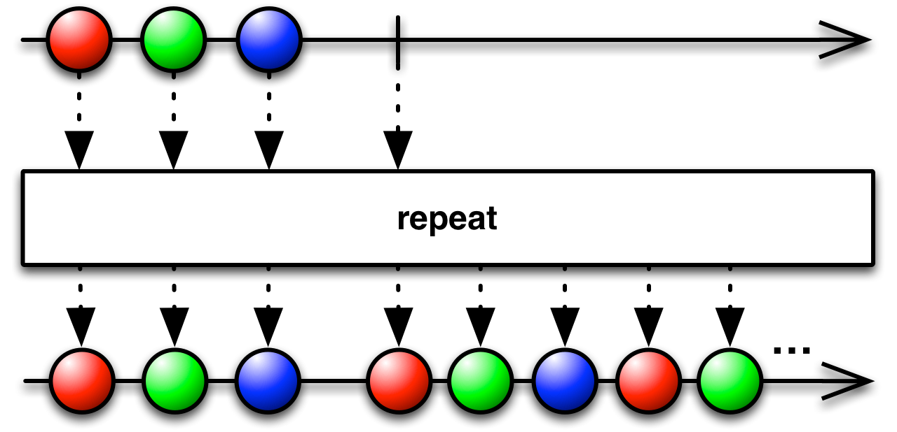
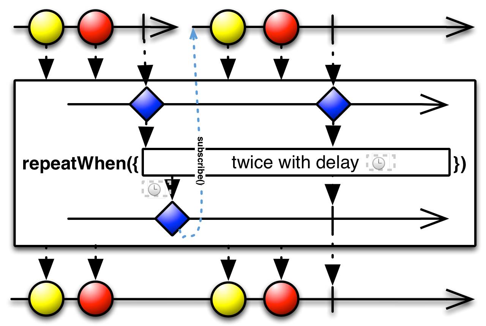
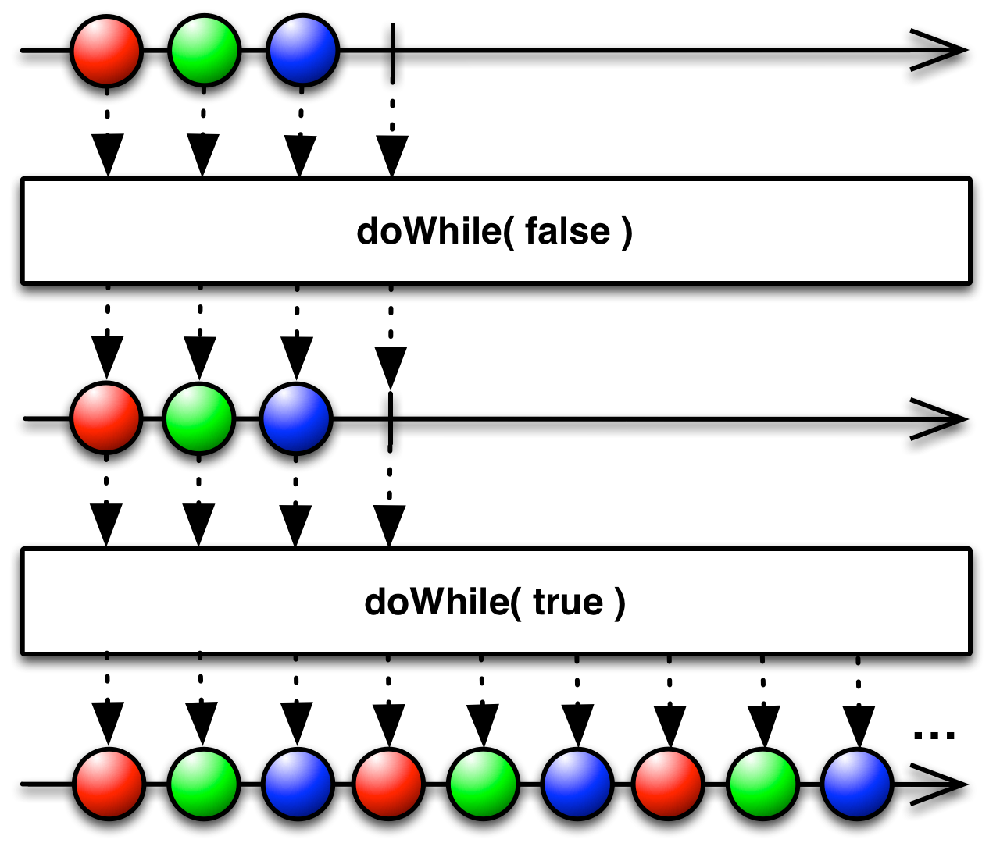

## Repeat

创建一个发射特定数据重复多次的Observable

Repeat重复地发射数据。某些实现允许你重复的发射某个数据序列，还有一些允许你限制重复的次数。

RxJava将这个操作符实现为`repeat`方法。它不是创建一个Observable，而是重复发射原始Observable的数据序列，这个序列或者是无限的，或者通过`repeat(n)`指定重复次数。

`repeat`操作符默认在`trampoline`调度器上执行。有一个变体可以通过可选参数指定Scheduler。

Javadoc: [repeat()](http://reactivex.io/RxJava/javadoc/rx/Observable.html#repeat())
Javadoc: [repeat(long)](http://reactivex.io/RxJava/javadoc/rx/Observable.html#repeat(long))
Javadoc: [repeat(Scheduler)](http://reactivex.io/RxJava/javadoc/rx/Observable.html#repeat(rx.Scheduler))
Javadoc: [repeat(long,Scheduler)](http://reactivex.io/RxJava/javadoc/rx/Observable.html#repeat(long,%20rx.Scheduler))

### repeatWhen

还有一个叫做`repeatWhen`的操作符，它不是缓存和重放原始Observable的数据序列，而是有条件的重新订阅和发射原来的Observable。

将原始Observable的终止通知（完成或错误）当做一个`void`数据传递给一个通知处理器，它以此来决定是否要重新订阅和发射原来的Observable。这个通知处理器就像一个Observable操作符，接受一个发射`void`通知的Observable为输入，返回一个发射`void`数据（意思是，重新订阅和发射原始Observable）或者直接终止（意思是，使用`repeatWhen`终止发射数据）的Observable。

`repeatWhen`操作符默认在`trampoline`调度器上执行。有一个变体可以通过可选参数指定Scheduler。

* Javadoc: [repeatWhen(Func1)](http://reactivex.io/RxJava/javadoc/rx/Observable.html#repeatWhen(rx.functions.Func1))
* Javadoc: [repeatWhen(Func1,Scheduler)](http://reactivex.io/RxJava/javadoc/rx/Observable.html#repeatWhen(rx.functions.Func1,%20rx.Scheduler))

### doWhile

`doWhile` 属于可选包`rxjava-computation-expressions`，不是RxJava标准操作符的一部分。`doWhile`在原始序列的每次重复后检查某个条件，如果满足条件才重复发射。

### whileDo

`whileDo` 属于可选包`rxjava-computation-expressions`，不是RxJava标准操作符的一部分。`whileDo`在原始序列的每次重复前检查某个条件，如果满足条件才重复发射。

