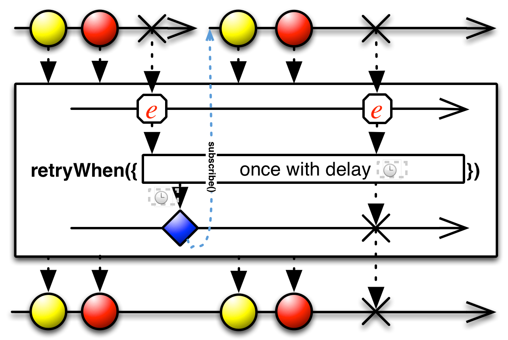

## Retry

如果原始Observable遇到错误，重新订阅它期望它能正常终止


`Retry`操作符不会将原始Observable的`onError`通知传递给观察者，它会订阅这个Observable，再给它一次机会无错误地完成它的数据序列。`Retry`总是传递`onNext`通知给观察者，由于重新订阅，可能会造成数据项重复，如上图所示。

RxJava中的实现为`retry`和`retryWhen`。

无论收到多少次`onError`通知，无参数版本的`retry`都会继续订阅并发射原始Observable。

接受单个`count`参数的`retry`会最多重新订阅指定的次数，如果次数超了，它不会尝试再次订阅，它会把最新的一个`onError`通知传递给它的观察者。

还有一个版本的`retry`接受一个谓词函数作为参数，这个函数的两个参数是：重试次数和导致发射`onError`通知的`Throwable`。这个函数返回一个布尔值，如果返回`true`，`retry`应该再次订阅和镜像原始的Observable，如果返回`false`，`retry`会将最新的一个`onError`通知传递给它的观察者。

`retry`操作符默认在`trampoline`调度器上执行。

* Javadoc: [retry()](http://reactivex.io/RxJava/javadoc/rx/Observable.html#retry())
* Javadoc: [retry(long)](http://reactivex.io/RxJava/javadoc/rx/Observable.html#retry(long))
* Javadoc: [retry(Func2)](http://reactivex.io/RxJava/javadoc/rx/Observable.html#retry(rx.functions.Func2))

### retryWhen



`retryWhen`和`retry`类似，区别是，`retryWhen`将`onError`中的`Throwable`传递给一个函数，这个函数产生另一个Observable，`retryWhen`观察它的结果再决定是不是要重新订阅原始的Observable。如果这个Observable发射了一项数据，它就重新订阅，如果这个Observable发射的是`onError`通知，它就将这个通知传递给观察者然后终止。

`retryWhen`默认在`trampoline`调度器上执行，你可以通过参数指定其它的调度器。

示例代码

```java

Observable.create((Subscriber<? super String> s) -> {
      System.out.println("subscribing");
      s.onError(new RuntimeException("always fails"));
  }).retryWhen(attempts -> {
      return attempts.zipWith(Observable.range(1, 3), (n, i) -> i).flatMap(i -> {
          System.out.println("delay retry by " + i + " second(s)");
          return Observable.timer(i, TimeUnit.SECONDS);
      });
  }).toBlocking().forEach(System.out::println);

```

输出

```
subscribing
delay retry by 1 second(s)
subscribing
delay retry by 2 second(s)
subscribing
delay retry by 3 second(s)
subscribing
```

* Javadoc: [retryWhen(Func1)](http://reactivex.io/RxJava/javadoc/rx/Observable.html#retryWhen(rx.functions.Func1))
* Javadoc: [retryWhen(Func1,Scheduler)](http://reactivex.io/RxJava/javadoc/rx/Observable.html#retryWhen(rx.functions.Func1,%20rx.Scheduler))
