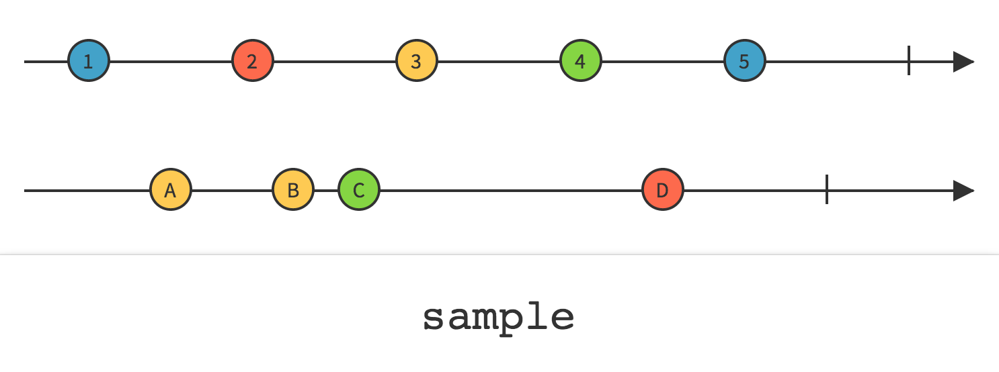
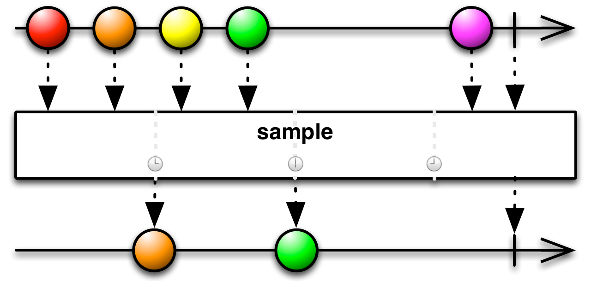

## Sample

定期发射Observable最近发射的数据项

`Sample`操作符定时查看一个Observable，然后发射自上次采样以来它最近发射的数据。

在某些实现中，有一个`ThrottleFirst`操作符的功能类似，但不是发射采样期间的最近的数据，而是发射在那段时间内的第一项数据。

RxJava将这个操作符实现为`sample`和`throttleLast`。

注意：如果自上次采样以来，原始Observable没有发射任何数据，这个操作返回的Observable在那段时间内也不会发射任何数据。

`sample`(别名`throttleLast`)的一个变体按照你参数中指定的时间间隔定时采样（`TimeUnit`指定时间单位）。

`sample`的这个变体默认在`computation`调度器上执行，但是你可以使用第三个参数指定其它的调度器。

* Javadoc: [sample(long,TimeUnit)](http://reactivex.io/RxJava/javadoc/rx/Observable.html#sample(long,%20java.util.concurrent.TimeUnit))和[throttleLast(long,TimeUnit)](http://reactivex.io/RxJava/javadoc/rx/Observable.html#throttleLast(long,%20java.util.concurrent.TimeUnit))
* Javadoc: [sample(long,TimeUnit,Scheduler)](http://reactivex.io/RxJava/javadoc/rx/Observable.html#sample(long,%20java.util.concurrent.TimeUnit,%20rx.Scheduler))和[throttleLast(long,TimeUnit,Scheduler)](http://reactivex.io/RxJava/javadoc/rx/Observable.html#throttleLast(long,%20java.util.concurrent.TimeUnit,%20rx.Scheduler))

`sample`的这个变体每当第二个Observable发射一个数据（或者当它终止）时就对原始Observable进行采样。第二个Observable通过参数传递给`sample`。

`sample`的这个变体默认不在任何特定的调度器上执行。

* Javadoc: [sample(Observable)](http://reactivex.io/RxJava/javadoc/rx/Observable.html#sample(rx.Observable))

`throttleFirst`与`throttleLast/sample`不同，在每个采样周期内，它总是发射原始Observable的第一项数据，而不是最近的一项。

`throttleFirst`操作符默认在`computation`调度器上执行，但是你可以使用第三个参数指定其它的调度器。

* Javadoc: [throttleFirst(long,TimeUnit)](http://reactivex.io/RxJava/javadoc/rx/Observable.html#throttleFirst(long,%20java.util.concurrent.TimeUnit))
* Javadoc: [throttleFirst(long,TimeUnit,Scheduler)](http://reactivex.io/RxJava/javadoc/rx/Observable.html#throttleFirst(long,%20java.util.concurrent.TimeUnit,%20rx.Scheduler))
