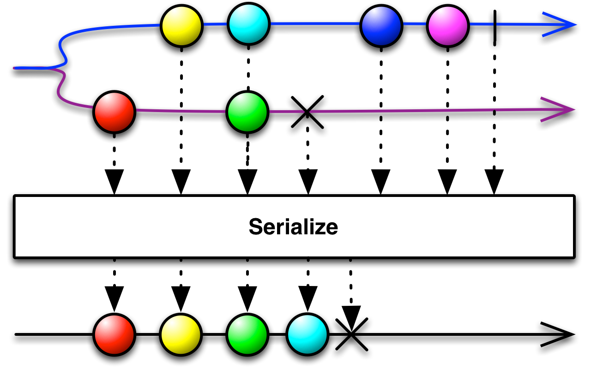

## Serialize

强制一个Observable连续调用并保证行为正确

一个Observable可以异步调用它的观察者的方法，可能是从不同的线程调用。这可能会让Observable行为不正确，它可能会在某一个`onNext`调用之前尝试调用`onCompleted`或`onError`方法，或者从两个不同的线程同时调用`onNext`方法。使用`Serialize`操作符，你可以纠正这个Observable的行为，保证它的行为是正确的且是同步的。

RxJava中的实现是`serialize`，它默认不在任何特定的调度器上执行。

* Javadoc: [serialize()](http://reactivex.io/RxJava/javadoc/rx/Observable.html#serialize())

