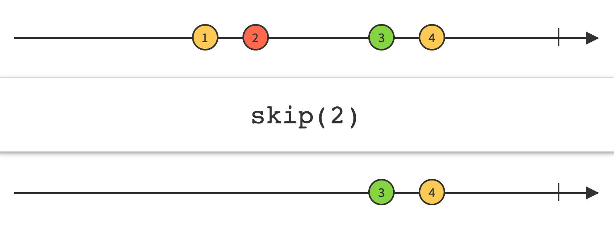
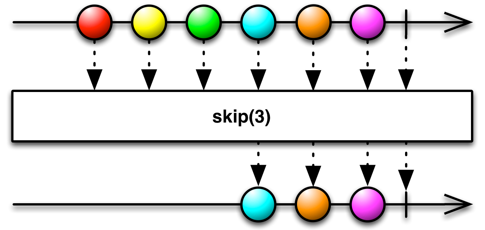
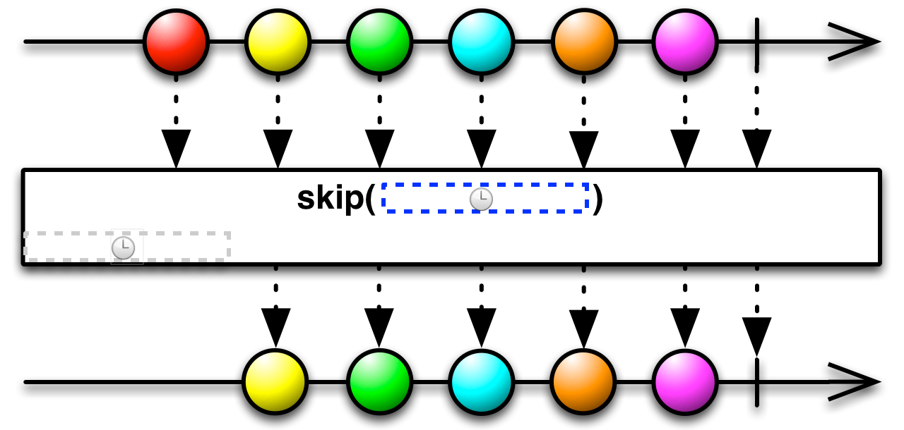

## Skip

抑制Observable发射的前N项数据

使用`Skip`操作符，你可以忽略Observable'发射的前N项数据，只保留之后的数据。

RxJava中这个操作符叫`skip`。`skip`的这个变体默认不在任何特定的调度器上执行。

* Javadoc: [skip(int)](http://reactivex.io/RxJava/javadoc/rx/Observable.html#skip(int))

`skip`的这个变体接受一个时长而不是数量参数。它会丢弃原始Observable开始的那段时间发射的数据，时长和时间单位通过参数指定。

`skip`的这个变体默认在`computation`调度器上执行，但是你可以使用第三个参数指定其它的调度器。

* Javadoc: [skip(long,TimeUnit)](http://reactivex.io/RxJava/javadoc/rx/Observable.html#skip(long,%20java.util.concurrent.TimeUnit))
* Javadoc: [skip(long,TimeUnit,Scheduler)](http://reactivex.io/RxJava/javadoc/rx/Observable.html#skip(long,%20java.util.concurrent.TimeUnit,%20rx.Scheduler))

