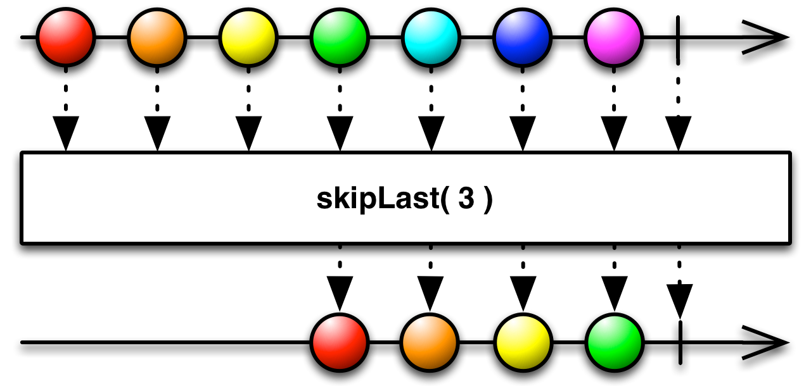

## SkipLast

抑制Observable发射的后N项数据

使用`SkipLast `操作符修改原始Observable，你可以忽略Observable'发射的后N项数据，只保留前面的数据。

使用`SkipLast`操作符，你可以忽略原始Observable发射的后N项数据，只保留之前的数据。注意：这个机制是这样实现的：延迟原始Observable发射的任何数据项，直到它发射了N项数据。

`skipLast`的这个变体默认不在任何特定的调度器上执行。

* Javadoc: [skipLast(int)](http://reactivex.io/RxJava/javadoc/rx/Observable.html#skipLast(int))

还有一个`skipLast`变体接受一个时长而不是数量参数。它会丢弃在原始Observable的生命周期内最后一段时间内发射的数据。时长和时间单位通过参数指定。

注意：这个机制是这样实现的：延迟原始Observable发射的任何数据项，直到自这次发射之后过了给定的时长。

`skipLast `的这个变体默认在`computation`调度器上执行，但是你可以使用第三个参数指定其它的调度器。

* Javadoc: [skipLast(long,TimeUnit)](http://reactivex.io/RxJava/javadoc/rx/Observable.html#skipLast(long,%20java.util.concurrent.TimeUnit))
* Javadoc: [skipLast(long,TimeUnit,Scheduler)](http://reactivex.io/RxJava/javadoc/rx/Observable.html#skipLast(long,%20java.util.concurrent.TimeUnit,%20rx.Scheduler))
