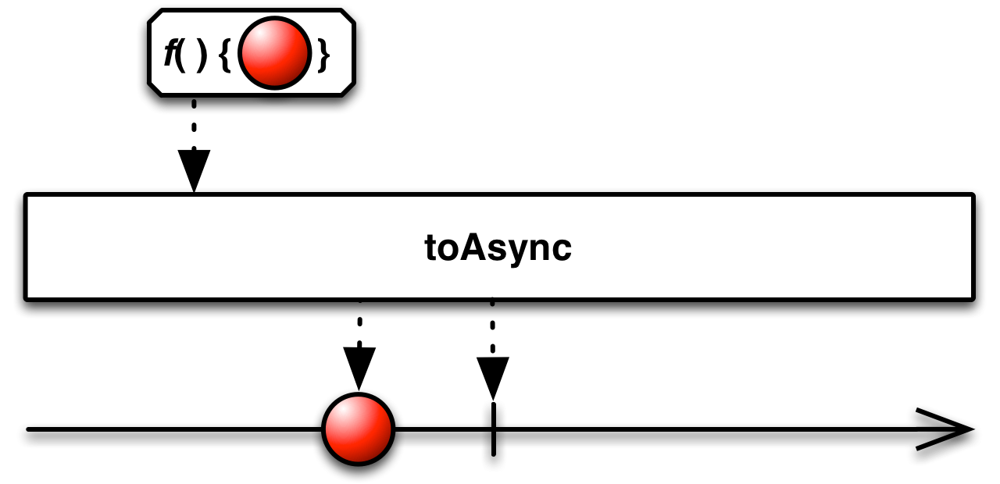
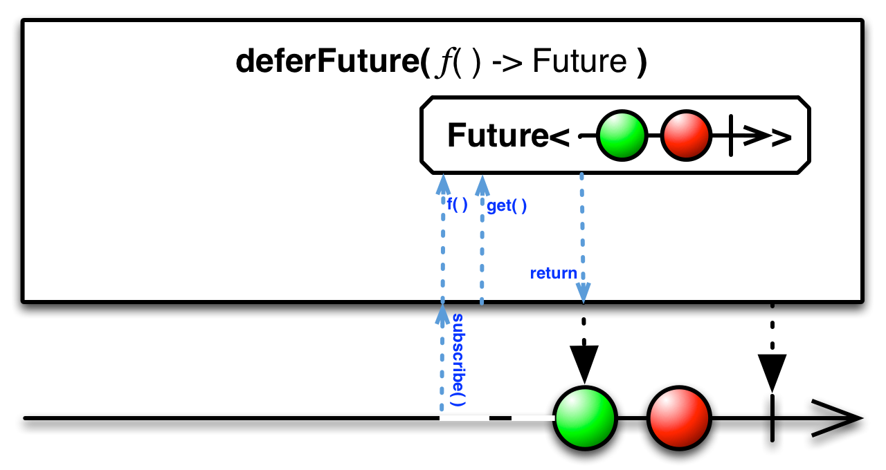
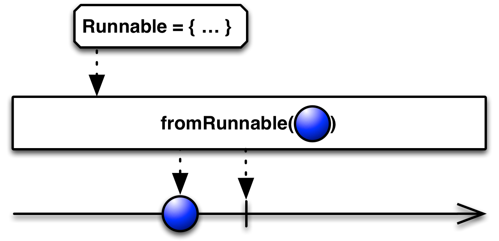
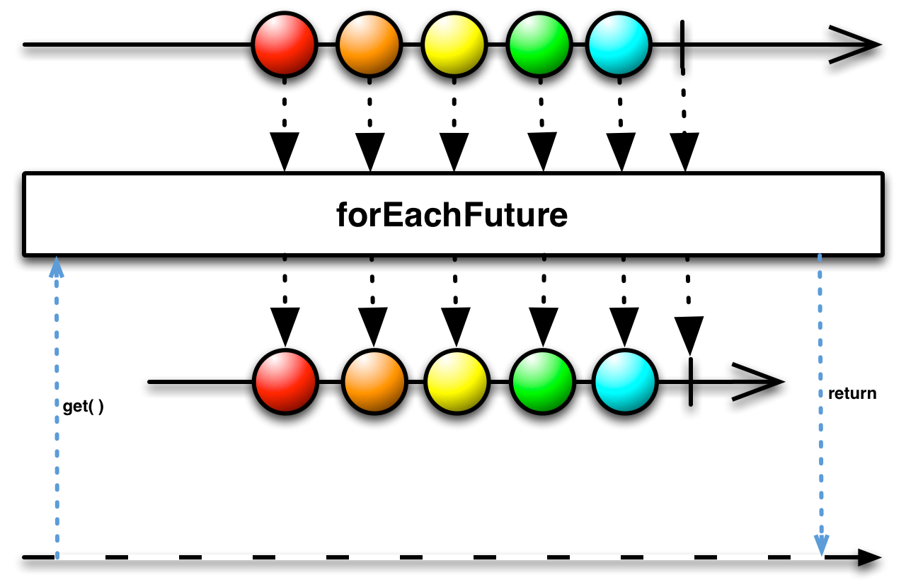

## Start

返回一个Observable，它发射一个类似于函数声明的值

编程语言有很多种方法可以从运算结果中获取值，它们的名字一般叫`functions, futures, actions, callables, runnables`等等。在`Start`目录下的这组操作符可以让它们表现得像Observable，因此它们可以在Observables调用链中与其它Observable搭配使用。

`Start`操作符的多种RxJava实现都属于可选的`rxjava-async`模块。

`rxjava-async`模块包含`start`操作符，它接受一个函数作为参数，调用这个函数获取一个值，然后返回一个会发射这个值给后续观察者的Observable。

注意：这个函数只会被执行一次，即使多个观察者订阅这个返回的Observable。

### toAsync

`rxjava-async`模块还包含这几个操作符：`toAsync`, `asyncAction`, 和`asyncFunc`。它们接受一个函数或一个Action作为参数。

对于函数(functions)，这个操作符调用这个函数获取一个值，然后返回一个会发射这个值给后续观察者的Observable（和`start`一样）。对于动作(Action)，过程类似，但是没有返回值，在这种情况下，这个操作符在终止前会发射一个`null`值。

注意：这个函数或动作只会被执行一次，即使多个观察者订阅这个返回的Observable。

### startFuture

`rxjava-async`模块还包含一个`startFuture`操作符，传递给它一个返回`Future`的函数，`startFuture`会立即调用这个函数获取`Future`对象，然后调用`Future`的`get()`方法尝试获取它的值。它返回一个发射这个值给后续观察者的Observable。

### deferFuture

`rxjava-async`模块还包含一个`deferFuture`操作符，传递给它一个返回`Future`的函数（这个`Future`返回一个`Observable`），`deferFuture`返回一个Observable，但是不会调用你提供的函数，直到有观察者订阅它返回的Observable。这时，它立即调用`Future`的`get()`方法，然后镜像发射`get()`方法返回的Observable发射的数据。

用这种方法，你可以在Observables调用链中包含一个返回Observable的`Future`对象。

### fromAction

`rxjava-async`模块还包含一个`fromAction`操作符，它接受一个`Action`作为参数，返回一个Observable，一旦Action终止，它发射这个你传递给`fromAction`的数据。

### fromCallable

`rxjava-async`模块还包含一个`fromCallable`操作符，它接受一个`Callable`作为参数，返回一个发射这个`Callable`的结果的Observable。

### fromRunnable

`rxjava-async`模块还包含一个`fromRunnable`操作符，它接受一个`Runnable `作为参数，返回一个Observable，一旦Runnable终止，它发射这个你传递给`fromRunnable`的数据。

### forEachFuture

`rxjava-async`模块还包含一个`forEachFuture`操作符。它其实不算`Start`操作符的一个变体，而是有一些自己的特点。你传递一些典型的观察者方法（如onNext, onError和onCompleted）给它，Observable会以通常的方式调用它。但是`forEachFuture`自己返回一个`Future`并且在`get()`方法处阻塞，直到原始Observable执行完成，然后它返回，完成还是错误依赖于原始Observable是完成还是错误。

如果你想要一个函数阻塞直到Observable执行完成，可以使用这个操作符。

### runAsync

`rxjava-async`模块还包含一个`runAsync`操作符。它很特殊，返回一个叫做`StoppableObservable `的特殊Observable。

传递一个`Action`和一个`Scheduler`给`runAsync`，它返回一个使用这个`Action`产生数据的`StoppableObservable`。这个`Action`接受一个`Observable`和一个`Subscription`作为参数，它使用`Subscription`检查`unsubscribed`条件，一旦发现条件为真就立即停止发射数据。在任何时候你都可以使用`unsubscribe`方法手动停止一个`StoppableObservable`（这会同时取消订阅与这个`StoppableObservable`关联的`Subscription`）。

由于`runAsync`会立即调用`Action`并开始发射数据，在你创建StoppableObservable之后到你的观察者准备好接受数据之前这段时间里，可能会有一部分数据会丢失。如果这不符合你的要求，可以使用`runAsync`的一个变体，它也接受一个`Subject`参数，传递一个`ReplaySubject`给它，你可以获取其它丢失的数据了。

在RxJava中还有一个版本的`From`操作符可以将Future转换为Observable，与`start`相似。
