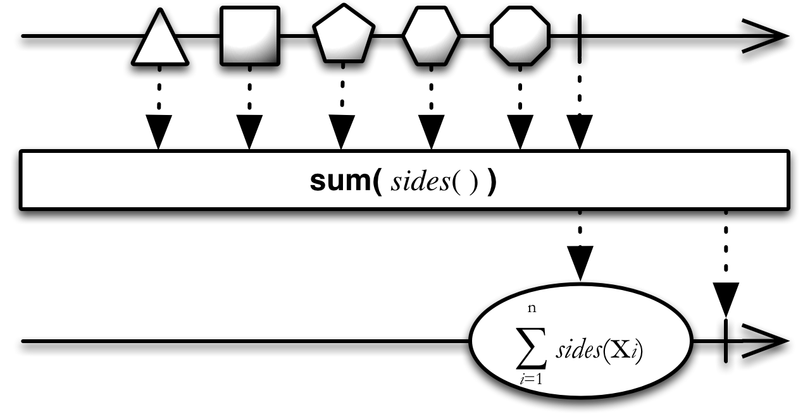

## Sum

计算Observable发射的数值的和并发射这个和

`Sum`操作符操作一个发射数值的Observable，仅发射单个值：原始Observable所有数值的和。

RxJava的实现是`sumDouble`, `sumFloat`, `sumInteger`, `sumLong`，它们不是RxJava核心模块的一部分，属于`rxjava-math`模块。

你可以使用一个函数，计算Observable每一项数据的函数返回值的和。

在`StringObservable`类（这个类不是RxJava核心模块的一部分）中有一个`stringConcat`操作符，它将一个发射字符串序列的Observable转换为一个发射单个字符串的Observable，后者这个字符串表示的是前者所有字符串的连接。

`StringObservable`类还有一个`join`操作符，它将一个发射字符串序列的Observable转换为一个发射单个字符串的Observable，后者这个字符串表示的是前者所有字符串以你指定的分界符连接的结果。
