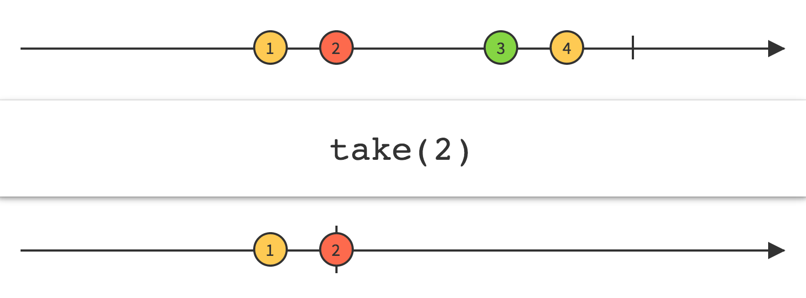

## Take

只发射前面的N项数据



使用`Take`操作符让你可以修改Observable的行为，只返回前面的N项数据，然后发射完成通知，忽略剩余的数据。


RxJava将这个操作符实现为`take`函数。

如果你对一个Observable使用`take(n)`（或它的同义词`limit(n)`）操作符，而那个Observable发射的数据少于N项，那么`take`操作生成的Observable不会抛异常或发射`onError`通知，在完成前它只会发射相同的少量数据。

示例代码

```java
Observable.just(1, 2, 3, 4, 5, 6, 7, 8)
          .take(4)
          .subscribe(new Subscriber<Integer>() {
        @Override
        public void onNext(Integer item) {
            System.out.println("Next: " + item);
        }

        @Override
        public void onError(Throwable error) {
            System.err.println("Error: " + error.getMessage());
        }

        @Override
        public void onCompleted() {
            System.out.println("Sequence complete.");
        }
    });
```

输出

```
Next: 1
Next: 2
Next: 3
Next: 4
Sequence complete.
```

`take(int)`默认不任何特定的调度器上执行。

* Javadoc: [take(int)](http://reactivex.io/RxJava/javadoc/rx/Observable.html#take(int))


`take`的这个变体接受一个时长而不是数量参数。它会丢发射Observable开始的那段时间发射的数据，时长和时间单位通过参数指定。

`take`的这个变体默认在`computation`调度器上执行，但是你可以使用第三个参数指定其它的调度器。

* Javadoc: [take(long,TimeUnit)](http://reactivex.io/RxJava/javadoc/rx/Observable.html#take(long,%20java.util.concurrent.TimeUnit))
* Javadoc: [take(long,TimeUnit,Scheduler)](http://reactivex.io/RxJava/javadoc/rx/Observable.html#take(long,%20java.util.concurrent.TimeUnit,%20rx.Scheduler))

