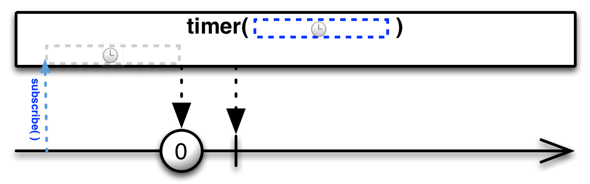

## Timer

创建一个Observable，它在一个给定的延迟后发射一个特殊的值。

`Timer`操作符创建一个在给定的时间段之后返回一个特殊值的Observable。

RxJava将这个操作符实现为`timer`函数。

`timer`返回一个Observable，它在延迟一段给定的时间后发射一个简单的数字0。

`timer `操作符默认在`computation `调度器上执行。有一个变体可以通过可选参数指定Scheduler。

* Javadoc: [timer(long,TimeUnit)](http://reactivex.io/RxJava/javadoc/rx/Observable.html#timer(long,%20java.util.concurrent.TimeUnit))
* Javadoc: [timer(long,TimeUnit,Scheduler)](http://reactivex.io/RxJava/javadoc/rx/Observable.html#timer(long,%20java.util.concurrent.TimeUnit,%20rx.Scheduler))
