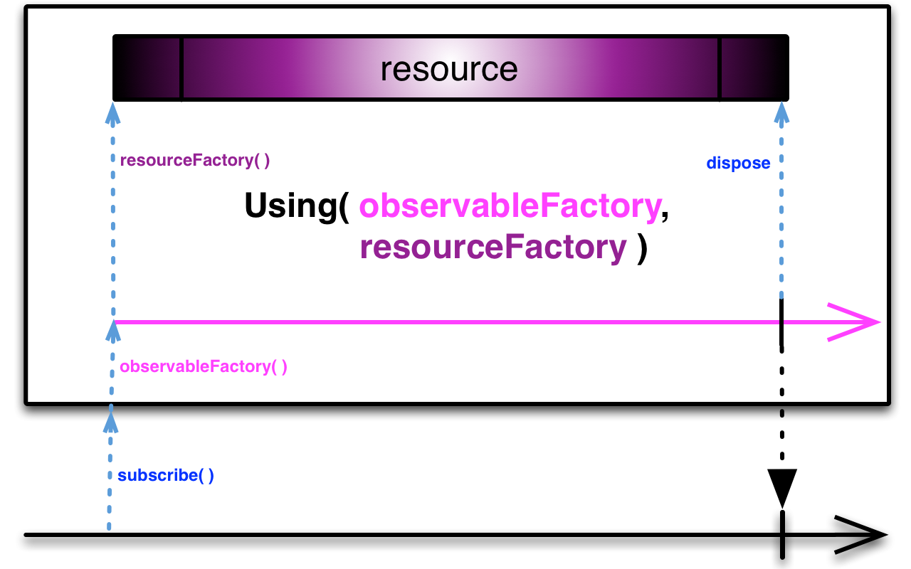

## Using

创建一个只在Observable生命周期内存在的一次性资源

`Using`操作符让你可以指示Observable创建一个只在它的生命周期内存在的资源，当Observable终止时这个资源会被自动释放。

`using`操作符接受三个参数：

1. 一个用户创建一次性资源的工厂函数
2. 一个用于创建Observable的工厂函数
3. 一个用于释放资源的函数

当一个观察者订阅`using`返回的Observable时，`using`将会使用Observable工厂函数创建观察者要观察的Observable，同时使用资源工厂函数创建一个你想要创建的资源。当观察者取消订阅这个Observable时，或者当观察者终止时（无论是正常终止还是因错误而终止），`using`使用第三个函数释放它创建的资源。

`using`默认不在任何特定的调度器上执行。

* Javadoc: [using(Func0,Func1,Action1)](http://reactivex.io/RxJava/javadoc/rx/Observable.html#using(rx.functions.Func0,%20rx.functions.Func1,%20rx.functions.Action1))

