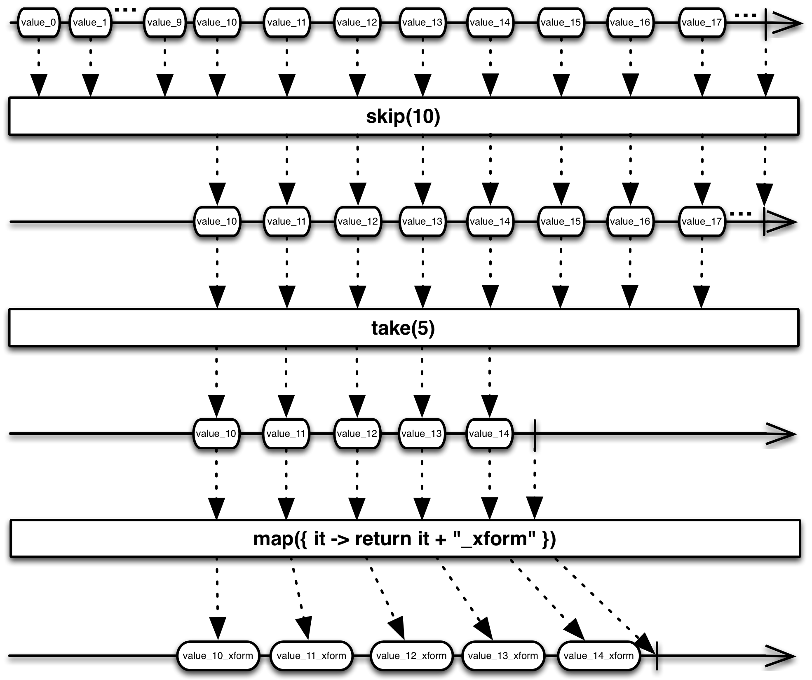
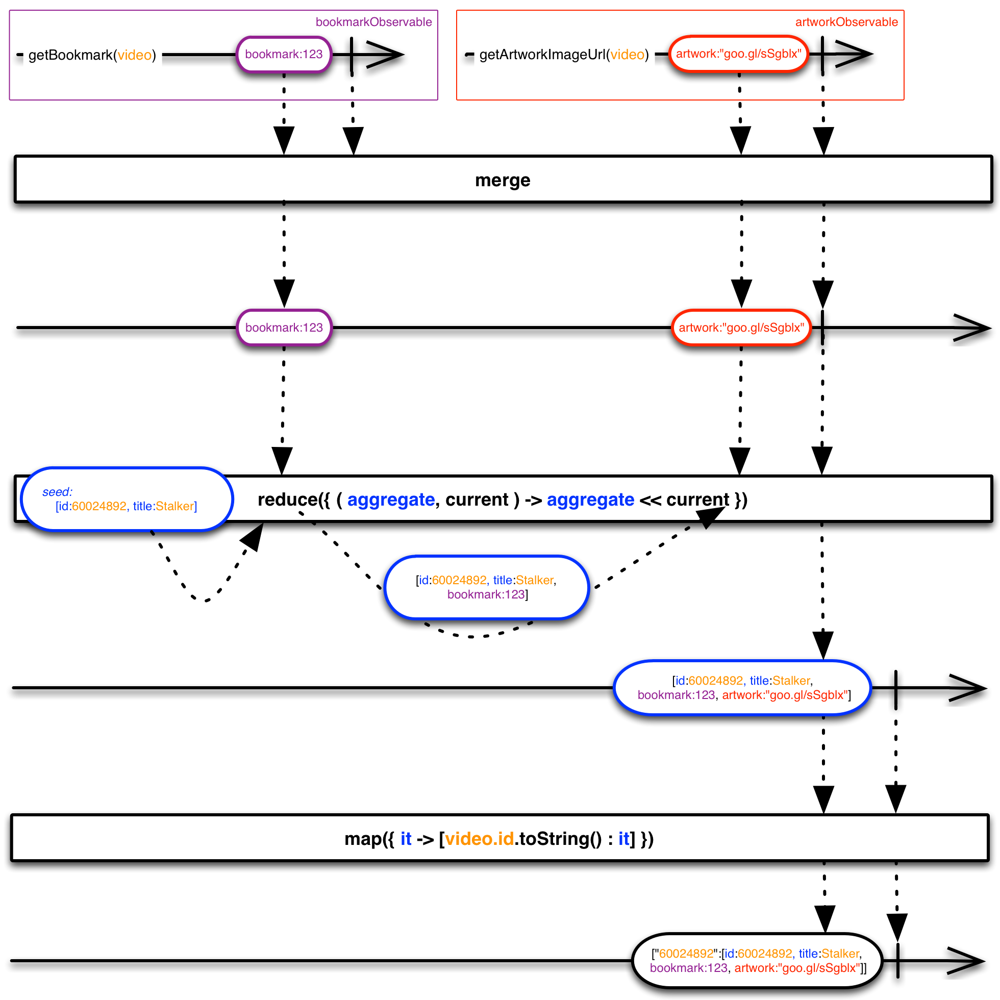

# 第一个例子

你可以在这里找到JVM平台几种语言的例子 [language adaptor](https://github.com/ReactiveX/):

* [RxGroovy 示例](https://github.com/ReactiveX/RxGroovy/tree/1.x/src/examples/groovy/rx/lang/groovy/examples)
* [RxClojure 示例](https://github.com/ReactiveX/RxClojure/tree/0.x/src/examples/clojure/rx/lang/clojure/examples)
* [RxScala 示例](https://github.com/ReactiveX/RxScala/tree/0.x/examples/src/main/scala)

下面的示例从一个字符串列表创建一个Observable，然后使用一个方法订阅这个Observable。

### Java

```java
public static void hello(String... names) {
    Observable.from(names).subscribe(new Action1<String>() {

        @Override
        public void call(String s) {
            System.out.println("Hello " + s + "!");
        }

    });
}
```

```java
hello("Ben", "George");
Hello Ben!
Hello George!
```

### Groovy

```groovy
def hello(String[] names) {
    Observable.from(names).subscribe { println "Hello ${it}!" }
}
```

```groovy
hello("Ben", "George")
Hello Ben!
Hello George!
```

### Clojure

```clojure
(defn hello
  [&rest]
  (-> (Observable/from &rest)
    (.subscribe #(println (str "Hello " % "!")))))
```

```
(hello ["Ben" "George"])
Hello Ben!
Hello George!
```
### Scala

```scala
import rx.lang.scala.Observable

def hello(names: String*) {
  Observable.from(names) subscribe { n =>
    println(s"Hello $n!")
  }
}
```

```scala
hello("Ben", "George")
Hello Ben!
Hello George!
```

# 如何使用RxJava

要使用RxJava，首先你需要创建Observable（它们发射数据序列），使用Observable操作符变换那些Observables，获取严格符合你要求的数据，然后观察并处理对这些数据序列（通过实现观察者或订阅者，然后订阅变换后的Observable）。

## 创建Observables

要创建Observable，你可以手动实现Observable的行为，也可以传递一个函数给[`create( )`](../operators/Create.md)，还可以使用这些 [创建操作符](../operators/Creating-Observables.md) 将一个已有的数据结构转换为Observable。

### 已有的数据结构创建Observable

你可以使用[`just( )`](../operators/Just.md) 和[`from( )`](../operators/From.md) 方法将对象，列表，对象属性转换为发射那些对象的Observable：

```java
Observable<String> o = Observable.from("a", "b", "c");

def list = [5, 6, 7, 8]
Observable<Integer> o = Observable.from(list);

Observable<String> o = Observable.just("one object");
```

转换后的Observable每发射一项数据，会同步地调用任何订阅者的[`onNext()`](../Observables.md#回调方法)方法，最后会调用订阅者的[`onCompleted()`](../Observables.md#回调方法)方法。

### 使用`create( )`创建一个Observable

使用 [`create( )`](../operators/Create.md) 方法，你可以创建你自己的Observable，可以实现异步I/O，计算操作，甚至是无限的数据流。

#### 同步的Observable示例

```groovy
/**
 * 这个例子展示了一个自定义的Observable，当有订阅时他会阻塞当前线程。
 */
def customObservableBlocking() {
    return Observable.create { aSubscriber ->
        50.times { i ->
            if (!aSubscriber.unsubscribed) {
                aSubscriber.onNext("value_${i}")
            }
        }
        // after sending all values we complete the sequence
        if (!aSubscriber.unsubscribed) {
            aSubscriber.onCompleted()
        }
    }
}

// To see output:
customObservableBlocking().subscribe { println(it) }
```

#### 异步的Observable示例

The following example uses Groovy to create an Observable that emits 75 strings.
下面的例子使用`Groovy`创建了一个发射75个字符串的Observable。

为了让它更清楚，例子很详细，使用静态类型和匿名内部类`Func1`：

```groovy
/**
 * This example shows a custom Observable that does not block
 * when subscribed to as it spawns a separate thread.
 */
def customObservableNonBlocking() {
    return Observable.create({ subscriber ->
        Thread.start {
            for (i in 0..<75) {
                if (subscriber.unsubscribed) {
                    return
                }
                subscriber.onNext("value_${i}")
            }
            // after sending all values we complete the sequence
            if (!subscriber.unsubscribed) {
                subscriber.onCompleted()
            }
        }
    } as Observable.OnSubscribe)
}

// To see output:
customObservableNonBlocking().subscribe { println(it) }
```

这是一个用`Clojure`写的例子，使用Future（而不是直接用线程），实现很简洁：

```clojure
(defn customObservableNonBlocking []
  "This example shows a custom Observable that does not block 
   when subscribed to as it spawns a separate thread.
   
  returns Observable<String>"
  (Observable/create 
    (fn [subscriber]
      (let [f (future 
                (doseq [x (range 50)] (-> subscriber (.onNext (str "value_" x))))
                ; after sending all values we complete the sequence
                (-> subscriber .onCompleted))
        ))
      ))
```

```clojure
; To see output
(.subscribe (customObservableNonBlocking) #(println %))
```

这个例子从维基百科网站抓取文章，每抓取一篇会调用一次`onNext`：

```clojure
(defn fetchWikipediaArticleAsynchronously [wikipediaArticleNames]
  "Fetch a list of Wikipedia articles asynchronously.
  
   return Observable<String> of HTML"
  (Observable/create 
    (fn [subscriber]
      (let [f (future
                (doseq [articleName wikipediaArticleNames]
                  (-> subscriber (.onNext (http/get (str "http://en.wikipedia.org/wiki/" articleName)))))
                ; after sending response to onnext we complete the sequence
                (-> subscriber .onCompleted))
        ))))
```

```clojure
(-> (fetchWikipediaArticleAsynchronously ["Tiger" "Elephant"]) 
  (.subscribe #(println "--- Article ---\n" (subs (:body %) 0 125) "...")))
```

回到`Groovy`，同样是从维基百科抓取文章，这儿使用闭包代替匿名内部类：

```groovy
/*
 * Fetch a list of Wikipedia articles asynchronously.
 */
def fetchWikipediaArticleAsynchronously(String... wikipediaArticleNames) {
    return Observable.create { subscriber ->
        Thread.start {
            for (articleName in wikipediaArticleNames) {
                if (subscriber.unsubscribed) {
                    return
                }
                subscriber.onNext(new URL("http://en.wikipedia.org/wiki/${articleName}").text)
            }
            if (!subscriber.unsubscribed) {
                subscriber.onCompleted()
            }
        }
        return subscriber
    }
}

fetchWikipediaArticleAsynchronously("Tiger", "Elephant")
    .subscribe { println "--- Article ---\n${it.substring(0, 125)}" }
```

结果：

```text
--- Article ---
 <!DOCTYPE html>
<html lang="en" dir="ltr" class="client-nojs">
<head>
<title>Tiger - Wikipedia, the free encyclopedia</title> ...
--- Article ---
 <!DOCTYPE html>
<html lang="en" dir="ltr" class="client-nojs">
<head>
<title>Elephant - Wikipedia, the free encyclopedia</tit ...
```

Note that all of the above examples ignore error handling, for brevity. See below for examples that include error handling.

More information can be found on the [[Observable]] and [[Creating Observables|Creating-Observables]] pages.

注意：为了简洁，上面的所有例子都忽略了错误处理，查看下面包含错误处理的例子。

更多的信息可以在这里找到：[`Observable`](Observables.md) 和 [`Creating Observables`](../operators/Creating-Observables.md)。

## 使用变换操作

RxJava让你可以链式使用`操作符`用来转换和组合多个Observables。

The following example, in Groovy, uses a previously defined, asynchronous Observable that emits 75 items, skips over the first 10 of these ([`skip(10)`](http://reactivex.io/documentation/operators/skip.html)), then takes the next 5 ([`take(5)`](http://reactivex.io/documentation/operators/take.html)), and transforms them ([`map(...)`](http://reactivex.io/documentation/operators/map.html)) before subscribing and printing the items:

下面是一个`Groovy`的例子，使用之前的定义，它会异步发射75个字符串，跳过最开始的10个（([`skip(10)`](../operators/Skip.md)），然后获取接下来的5个（[`take(5)`](../operators/Taks.md)），在订阅之前使用[`map()`](../operators/Map.md)转换它们，然后打印结果字符串。

```groovy
/**
 * Asynchronously calls 'customObservableNonBlocking' and defines
 * a chain of operators to apply to the callback sequence.
 */
def simpleComposition() {
    customObservableNonBlocking().skip(10).take(5)
        .map({ stringValue -> return stringValue + "_xform"})
        .subscribe({ println "onNext => " + it})
}
```

输出结果

```text
onNext => value_10_xform
onNext => value_11_xform
onNext => value_12_xform
onNext => value_13_xform
onNext => value_14_xform
```

这里有一个图例解释了转换过程：



这一个例子使用`Clojure`，使用了三个异步的Observable，其中一个依赖另一个，使用[`zip`](../operators/Zip.md)组合这三个发射的数据项为一个单个数据项，最后使用[`map()`](../operators/Map.md)转换这个结果：

```clojure
(defn getVideoForUser [userId videoId]
  "Get video metadata for a given userId
   - video metadata
   - video bookmark position
   - user data
  return Observable<Map>"
    (let [user-observable (-> (getUser userId)
              (.map (fn [user] {:user-name (:name user) :language (:preferred-language user)})))
          bookmark-observable (-> (getVideoBookmark userId videoId)
              (.map (fn [bookmark] {:viewed-position (:position bookmark)})))
          ; getVideoMetadata requires :language from user-observable so nest inside map function
          video-metadata-observable (-> user-observable 
              (.mapMany
                ; fetch metadata after a response from user-observable is received
                (fn [user-map] 
                  (getVideoMetadata videoId (:language user-map)))))]
          ; now combine 3 observables using zip
          (-> (Observable/zip bookmark-observable video-metadata-observable user-observable 
                (fn [bookmark-map metadata-map user-map]
                  {:bookmark-map bookmark-map 
                  :metadata-map metadata-map
                  :user-map user-map}))
            ; and transform into a single response object
            (.map (fn [data]
                  {:video-id videoId
                   :video-metadata (:metadata-map data)
                   :user-id userId
                   :language (:language (:user-map data))
                   :bookmark (:viewed-position (:bookmark-map data))
                  })))))
```

输出是这样的：

```clojure
{:video-id 78965, 
 :video-metadata {:video-id 78965, :title House of Cards: Episode 1, 
                  :director David Fincher, :duration 3365}, 
 :user-id 12345, :language es-us, :bookmark 0}
```

这里有一个图例解释了这个过程：


The following example, in Groovy, comes from [Ben Christensen’s QCon presentation on the evolution of the Netflix API](https://speakerdeck.com/benjchristensen/evolution-of-the-netflix-api-qcon-sf-2013). It combines two Observables with the [`merge`](http://reactivex.io/documentation/operators/merge.html) operator, then uses the [`reduce`](http://reactivex.io/documentation/operators/reduce.html) operator to construct a single item out of the resulting sequence, then transforms that item with [`map`](http://reactivex.io/documentation/operators/map.html) before emitting it:

下面的例子使用`Groovy`，来自这里 [Ben Christensen’s QCon presentation on the evolution of the Netflix API](https://speakerdeck.com/benjchristensen/evolution-of-the-netflix-api-qcon-sf-2013)，它使用[`merge`](../operators/Merge.md)操作结合两个Observables，使用[`reduce`](../operators/Reduce.md)操作符从结果序列构建一个单独的结果数据项，然后在发射之前，使用[`map()`](../operators/Map.md)变换那个结果。

```groovy
public Observable getVideoSummary(APIVideo video) {
   def seed = [id:video.id, title:video.getTitle()];
   def bookmarkObservable = getBookmark(video);
   def artworkObservable = getArtworkImageUrl(video);
   return( Observable.merge(bookmarkObservable, artworkObservable)
      .reduce(seed, { aggregate, current -> aggregate << current })
      .map({ [(video.id.toString() : it] }))
}
```

这里也有一个图例解释[`reduce`](../operators/Reduce.md)从多个Observable的结果构建一个单一结构的过程：



## 错误处理

这里是另一个版本的维基百科的例子，包含错误处理代码：

```groovy
/*
 * Fetch a list of Wikipedia articles asynchronously, with error handling.
 */
def fetchWikipediaArticleAsynchronouslyWithErrorHandling(String... wikipediaArticleNames) {
    return Observable.create({ subscriber ->
        Thread.start {
            try {
                for (articleName in wikipediaArticleNames) {
                    if (true == subscriber.isUnsubscribed()) {
                        return;
                    }
                    subscriber.onNext(new URL("http://en.wikipedia.org/wiki/"+articleName).getText());
                }
                if (false == subscriber.isUnsubscribed()) {
                    subscriber.onCompleted();
                }
            } catch(Throwable t) {
                if (false == subscriber.isUnsubscribed()) {
                    subscriber.onError(t);
                }
            }
            return (subscriber);
        }
    });
}
```

下面的例子使用`Groovy`，注意错误发生时现在是如何调用[`onError(Throwable t)`](Observables.md#回调函数)的，下面的代码传递给[`subscribe()`](../operators/Subscribe.md)第二个方法用户处理`onError`通知：

```groovy
fetchWikipediaArticleAsynchronouslyWithErrorHandling("Tiger", "NonExistentTitle", "Elephant")
    .subscribe(
        { println "--- Article ---\n" + it.substring(0, 125) }, 
        { println "--- Error ---\n" + it.getMessage() })
```


查看 [`错误处理操作符`](../operators/Error-Handling-Operators.md) 这一页了解更多RxJava中的错误处理技术，包括使用 [`onErrorResumeNext()`和`onErrorReturn()`](../operators/Catch.md)等方法，它们让你可以从错误中恢复。

这里是一个`Groovy`的例子：

```groovy
myModifiedObservable = myObservable.onErrorResumeNext({ t ->
   Throwable myThrowable = myCustomizedThrowableCreator(t);
   return (Observable.error(myThrowable));
});
```
